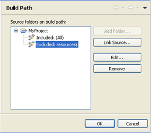
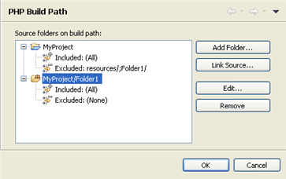
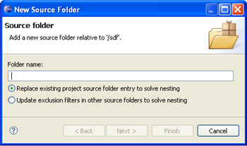
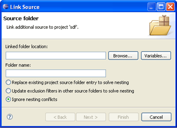

# Configuring a Project's PHP Build Path

<!--context:configuring_build_paths-->

By configuring your project's PHP Build Path, you can select resources which will be included or excluded from the Build process.

<!--note-start-->

#### Note:

If during project creation you selected the 'use project as source folder' under the Project Layout category, all resources within the folder will be added to the Build Path by default.  If you selected to 'create separate folders for source files and public resources' during the project's creation, resources in the 'public' folder will be excluded from the Build Path by default.

<!--note-end-->

The project's PHP Build Path can be configured through the project's Build Path properties page, accessed by right-clicking the required project and selecting Build Path | Configure Build Path.

This page allows you to add folders and resources to your Build Path and configure rules for including / excluding certain resources in the project.

You can configure your Build Path according to the options listed below.

Once you have made changes, click OK to save.

<!--note-start-->

#### Note:

By default, all folders which are on your Build Path will be included in your Include Path.

<!--note-end-->

### ConfiguringInclusion/Exclusion Patterns for the Project

By configuring inclusion/exclusion patterns for the Build Path, you can select to include or exclude all resources in your project which match a defined pattern.

<!--ref-start-->

To include/exclude resources from the Build Path:

 1. In the Build Path Properties page, expand the node next to the folder whose Inclusion/Exclusion pattern you want to configure and click Edit.  -Or- In Project Explorer view, right-click the folder whose Inclusion/Exclusion pattern you want to configure and select Build Path | Configure Inclusion / Exclusion Filters.  The Inclusion and Exclusion patterns dialog is displayed.

 1. Click Add next to the Inclusion or Exclusion patterns panes.  The Add Inclusion/Exclusion Pattern dialog is displayed.
 2. Enter or select the required resource(s) or pattern to include / exclude and click OK.
 3. Click Finish.

All resources in the project which match an inclusion pattern but do not match an exclusion pattern will be added to the Build Path.

<!--ref-end-->

### Configuring Different Inclusion/Exclusion Patterns for Folders Withinyour Project

You can configure different inclusion/exclusion rules for child folders within a selected directory. However, you will need to exclude the selected child folder from the parent directory's Build Path and add it as a separate Build Path source folder. This is done to resolve any conflicts which may arise from configuring one pattern for the parent folder and another for the child.

Source folders can be created and/or added from the PHP Build Path properties page or from Project Explorer view.

<!--ref-start-->

To add a directory as a separate source folder:

From the PHP Build Path Properties page:

 1. Click Add Folder...  The Source Folder Selection dialog will display.
 2. If necessary, click Create New Folder to create a new folder.
 3. Select the required folder and click OK.
 4. The folder will be added as a separate source folder in the Build Path list.

<!--note-start-->

#### Note:

In order to overcome the nesting conflict,  you should exclude the folder you have just added from the parent folder's Build Path. See '[Configuring Inclusion/Exclusion Patterns](#include_exclude_build_path1)', above, for information on how to exclude the folder and all resources contained within it.

<!--note-end-->

From Project Explorer view:

 1. Right-click the project and select Build Path | New Source Folder.  The New Source Folder dialog will be displayed. 
     1. Enter the name for the new folder in the Folder name field.
 2. Adding a folder to a project's Build Path could cause a conflict between the inclusion/exclusion patterns configured for the project root and those configured for the selected folder.  In order to avoid these nesting conflicts, select one of the following options:
    * Replace existing project source folder entry to solve nesting - This will remove your parent directory as a source folder from the Build Path configuration and replace it with the currently selected folder.
    * Update exclusion filters in other source folders to solve nesting - This will exclude the currently selected folder from the parent directory's Build Path but will add it as a separate entity so that different inclusion/exclusion patters can be configured for it.
 3. Click Finish.

You can now configure a pattern for including/excluding resources for the source folder by following the instructions under '[Configuring Inclusion/Exclusion Patterns](#include_exclude_build_path1)', above.

<!--ref-end-->

### Adding External Source Folders to the Build Path

You can add an external source folder as a link to your project which will be scanned during the Build process.

<!--ref-start-->

To add an external source folder to the project's Build Path:

 1. In the Build Path Properties page, click the 'Link Source...' button.  -Or- In Project Explorer view, right-click the project and select Build Path | Link Source.  The Link Source dialog is displayed. 
    1. Click the 'Browse..' button and browse to the location of the folder you want to add to the Build Path.  Alternately, click Variables and select the variable which points to the required resource.
 2. The Folder name field will have been automatically populated with the name of the original folder.  Edit this entry if required.
 3. Adding a folder to a project's Build Path could cause a conflict between the inclusion/exclusion patterns configured for the project root and those configured for the selected folder.  In order to avoid these nesting conflicts, select one of the following options:
    * Replace existing project source folder entry to solve nesting - This will remove your parent directory as a source folder from the Build Path configuration and replace it with the currently selected folder.
    * Update exclusion filters in other source folders to solve nesting - This will exclude the currently selected folder from the parent directory's Build Path but will add it as a separate entity so that different inclusion/exclusion patters can be configured for it.
    * Ignore nesting conflicts - The selected folder will be added as a separate entity to the Build Path list but will need to be manually excluded from the project root's Build Path to avoid nesting conflicts.
 4. Click Finish.

The folder will be added to your Build Path and displayed in the Build Path list.

You can now configure a pattern for including/excluding resources for the linked folder by following the instructions under '[Configuring Inclusion/Exclusion Patterns](#include_exclude_build_path1)', above.

<!--ref-end-->

<!--links-start-->

#### Related Links:

 * [Configuring a Project's Include Path](168-adding_elements_to_a_project_s_include_path.md)

<!--links-end-->
