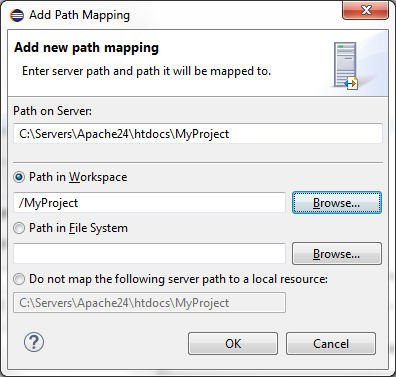

# Adding a Server Location Path Map

<!--context:adding_a_server_path_map-->

This procedure describes how to add a Path Map to a server so that files which are called from a certain location on the server will be searched for in a local location during PHP Web Page debugging .

See [Path Mapping](../016-concepts/160-path_mapping.md) for more details

<!--ref-start-->

To add a Path Map to a server:

 1. Open the PHP Servers Preferences Page by going to Window | Preferences on the Menu Bar and selecting PHP | PHP Servers from the Preferences list.
 2. Select the server on which you would like to create the Path Map and click Edit.
 3. In the Edit Server dialog, select the Path Mapping tab.
 4. Click Add.
 5. An Add new Path Mapping dialog appears.
 6. Enter the Server Path from which you would like to create the Path Map. Files called from this location will be searched for in the path specified below.
 7. Select either the 'Path in Workspace' or 'Path in File System' option and click Browse to specify the location. 
   
 8. Click OK.
    Your Path Map will be added to your server list.  
    
   The next time a file is called from the Path on Server, it will be searched for in the local location you have specified.
   
<!--ref-end-->

<!--note-start-->

#### Note:

Path Mapping can also be set automatically during Debugging . See the [Path Mapping](../016-concepts/160-path_mapping.md) topic for more details.

<!--note-end-->

<!--links-start-->

#### Related Links:

 * [Path Mapping](../016-concepts/160-path_mapping.md)
 * [PHP Servers Preferences](../032-reference/032-preferences/080-php_servers.md)

<!--links-end-->
