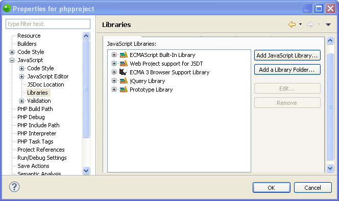
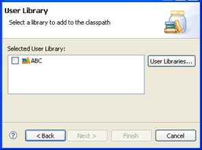
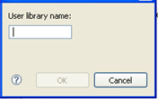
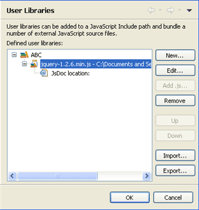
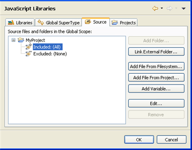
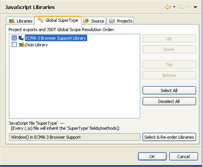
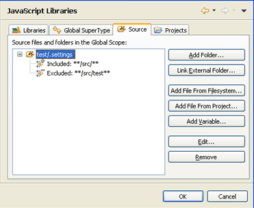
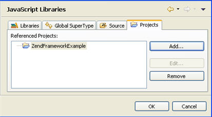

# Setting the JavaScript Build Path

<!--context:setting_the_javascript_build_path-->

The JavaScript build process scans all files, folders, projects and libraries that are on the project's JavaScript Build Path so that resources which are referenced in the project can be made available for Content Assist options . The required resources must therefore be included in the JavaScript Build Path.

JavaScript's Build Path allows you to select JavaScript resources to include/exclude from this process. Rather than automatically scanning all referenced projects and libraries, configuring the JavaScript Build Path allows you to select which resources will be scanned, and so can significantly speed up the build process.

<!--note-start-->

#### Note:

JavaScript Support must be [enabled for the project](008-enabling_javascript_support_in_php_projects.md) before you can set the JavaScript Build Path.

<!--note-end-->

The JavaScript Build Path is determined by the resources included in the project's JavaScript Libraries properties page.

<!--ref-start-->

To configure the project's JavaScript Build Path:

 1. In Project Explorer view, right-click the required project and select **Properties | JavaScript | JavaScript Libraries**.  In this properties page you can add the following elements to the project's JavaScript Build Path:
 2. [Libraries](#libraries-tab) - Built-in and user defined libraries contain pre-written collections of JavaScript source files that have prototyped object/class definitions and JsDoc.
 3. [Source](#source) - Other folders/files/variables from your file system or linked from an external source.
 4. [Projects](#projects) - Other projects in the workspace or on your file system
 5. [Global Super Types](#global-supertype-tab) - Each object/field/function in the added libraries will be added to the project's Global Scope. Every JavaScript file in the project will then have access to these objects/fields/functions.

### Libraries Tab

If your project references a JavaScript library, it should be added to this list so that it's elements can be available for Content Assist options.

Through the Libraries tab you can add PDT 's built-in libraries, or create and add your own User Libraries.

<!--note-start-->

### Note:

The default Runtime Libraries (Script Language Libraries, Web Project support for JSDT and ECMA 3 Browser Support Library) are added to the JavaScript Build Path automatically.

<!--note-end-->

To add a built-in library to the JavaScript Build Path:

 1. Click **Add a Runtime Library...**.  The Add Library dialog will appear.
 2. Select the required library and click Next and Finish.

To add a User Library to the JavaScript Build Path:

1. Click **Add a Runtime Library...**.  The Add Library dialog will appear.
2. Select **User Library** and click Next.  A list of previously configured **User Libraries** will appear.  
3. If you have not yet configured your User Libraries:
  1. Click the User Libraries button to be taken to the JavaScript User Libraries preferences page (also accessible from **Window | Preferences | JavaScript | Include Path | User Libraries**).
  2. Click New.  The New User Library dialog will open. 
  3. Enter a name for the library you would like to add and click OK.  The library name will be added to the User Libraries list. This is just a placeholder name to which you will add the required files in order to create your own library.
  4. Select the name from the list and click 'Add .js.'
  5. In the .js File Selection dialog, browse to the required JavaScript files on your file system and click Open.
  6. The JavaScript files will be added to your User Library.  
  7. Click OK to return to the User Library selection list.
4. Mark the checkbox of the User Library you would like to add to the project's Build Path and click Finish.  The User Library will be added to the project's JavaScript Libraries Build Path list.

To add a library folder from your Workspace to the JavaScript Build Path:

1. Click the 'Add a Library Folder' button.  The library folder selection dialog will display a list of available folders.
2. Select the required folder(s) and click OK.

### Source Tab

The Source tab allows you to include/exclude specific files, folders and variables from the JavaScript Build Path.

To add a folder from your Workspace:

1. Click Add folder.  The Source Folder Selection dialog will display.
2. Select the required folders and click OK.

To add an external folder:

1. Click Add External Folder.  The Link Source dialog is displayed.
2. Click Browse to select a folder from your file system and click OK.

To add a JavaScript file from your filesystem:

1. Click Add File from Filesystem.
2. Select a JavaScript file and click Open.

To add JavaScript files from your Workspace:

1. Click Add File From Project.
2. Select the required file(s) and click OK.

Using a Classpath Variable allows you to point to a JavaScript library without having to specify it's local file system location. This is important when sharing resources in a team.

To add a Variable Classpath Entry:

1. Click Add Variable.
2. The list of Configured Classpath Variables will be displayed.  If you have not configured any Classpath Variables:

1. Click the Configure Variables button to open the JavaScript Include Path Variables preferences page (also accessible from Window | Preferences | JavaScript | Include Path | Include Path Variables).
2. Click New.  The New Variable Entry dialog will appear.
3. Enter the Name and Path of the variable (click the File or Folder buttons to browse to the path).
4. Click OK.  The Variable will be added to the Include Path Variables list.
5. Click OK to return to the Variable Classpath Entry selection list.
5. Select the variable you would like to add to the project's JavaScript Build Path and click OK.

### Global SuperType Tab

The project's Global Scope contains all the objects, fields and functions contained in the libraries which have been added to the JavaScript Build Path. Elements in the Global SuperType will be available to all PHP and JavaScript files within the project.

In addition, the Global SuperType tab allows you to select a 'SuperType' class. All JavaScript elements which are not defined in their own class will automatically be added to this class. This will allow you to select these elements from the Content Assist list according to the SuperType Class name you selected.

To configure the SuperType class:

 1. Click the 'Select & Re-order Libraries' button.  The JavaScript Sourcefile SuperType Selection dialog will open.
 2. Select the class name for the SuperType class and click OK.  All elements which are not defined in a class will be added to the selected class. Entering the class name will display these elements in the Content Assist list.

<!--note-start-->

#### Note:

The Variable points to a folder. To choose an archive inside the folder, click Extend.

<!--note-end-->

Click OK.

You can choose to include or exclude specific resources or file name patterns from within source folders which you have added.

To include/exclude specific resources from the JavaScript Build Path:

 1. Expand the node next to the folder from which you would like to include/exclude resources.  A list of the resources which are included and excluded will be displayed (by default, all resources within the folder are included).
 2. Select the Included or Excluded list and click Edit.  The Inclusion and Exclusion patterns dialog is displayed.

 1. The Add Inclusion/Exclusion Pattern dialog is displayed.
 2. Enter or select the required resources / pattern to Include/Exclude and click OK.
 3. Click Finish.  All resources in the folder which match an Inclusion pattern but do not match an Exclusion pattern will be added to the JavaScript Build Path.  

### Projects Tab

The Projects tab allows you to select projects from your Workspace to add to the JavaScript Build Path.

To add a project to the JavaScript Build Path:

 1. Click the 'Add..' button.  The Required Project Selection dialog is displayed.
 2. Select the required projects and click OK.  The selected projects will be added to the JavaScript Build Path.

<!--note-start-->

#### Note:

During the Build process, the referenced projects will be built before the project itself.

<!--note-end-->

### Saving your changes

Once you have made all necessary changes to your JavaScript Build Path, click OK.

Click Add next to the Inclusion or Exclusion patterns panes.
Your project will be rebuilt to reflect the changes, according to the settings you configured.

<!--ref-end-->

<!--links-start-->

#### Related Links:

 * [JavaScript Support](PLUGINS_ROOT/com.zend.php.help/html/javascript.htm)
 * [Developing with JavaScript](PLUGINS_ROOT/com.zend.php.help/html/using_javascript.htm)
 * [Enabling JavaScript Support in PHP Projects](PLUGINS_ROOT/com.zend.php.help/html/enabling_javascript_support_in_php_projects.htm)
 * [Viewing JavaScript Elements in the Outline View](024-viewing_javascript_elements_in_the_outline_view.md)
 * [Using JavaScript Content Assist](032-using_javascript_content_assist.md)
 * [Using JavaScript Syntax Coloring](040-using_javascript_syntax_coloring.md)
 * [Using JavaScript Mark Occurrences](048-using_javascript_mark_occurences.md)

<!--links-end-->
