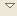
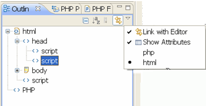

# Viewing JavaScript Elements in the Outline View

<!--context:viewing_javascript_elements_in_the_outline_view-->

This procedure describes how to view JavaScript objects and elements in the Outline view.

<!--ref-start-->

To view your JavaScript objects in the Outline view:

 1. Go to the Outline view.  If it is not displayed, go to **Window | Show View | Outline**.
 2. If your JavaScript objects are contained within a PHP file, click the Menu arrow  on the Outline view's toolbar and select html.  HTML and JavaScript objects contained within the file will be displayed in a tree view.  
    
 3. Double-Clicking the `<Script>` node in the outline view will select the entire `<script>` element in the Editor.

<!--ref-end-->

<!--links-start-->

#### Related Links:

 * [JavaScript Support](../../016-concepts/168-javascript.md)
 * [Developing with JavaScript](000-index.md)
 * [Enabling JavaScript Support in PHP Projects](008-enabling_javascript_support_in_php_projects.md)
 * [Setting the JavaScript Build Path](016-setting_the_javascript_build_path.md)
 * [Using JavaScript Content Assist](032-using_javascript_content_assist.md)
 * [Using JavaScript Syntax Coloring](040-using_javascript_syntax_coloring.md)
 * [Using JavaScript Mark Occurrences](048-using_javascript_mark_occurences.md)

<!--links-end-->
