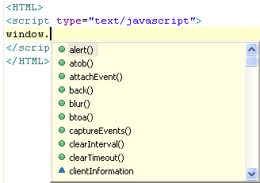

# Using JavaScript Content Assist

<!--context:using_javascript_content_assist-->

These procedures describe how to enable and configure JavaScript  [Content Assist](../../016-concepts/016-code_assist_concept.md) options.

<!--note-start-->

#### Note:

In order for JavaScript elements from libraries and files outside of the project to be made available for use in the Content Assist list, you must [enable JavaScript Support for the project](008-enabling_javascript_support_in_php_projects.md) and [Set the JavaScript Build Path](016-setting_the_javascript_build_path.md). To access Dojo toolkit content assist options, you must set up Dojo integration in the project while configuring the Build Path.

<!--note-end-->

<!--ref-start-->

To access JavaScript Content Assist options:

 1. Type the relevant HTML and JavaScript tags:  
 2. JavaScript Content Assist options will now be available.
 3. Type the first few letters of the required element.  The Content Assist list will be displayed (if the Content Assist list is not automatically displayed, press **Ctrl + Space** or go to your [JavaScript Content Assist preferences page](#javascript-content-assist-configuration) to configure your auto activation preferences).
 4. Select the relevant option from the Content Assist window by double-clicking or pressing Enter.
 5. If you selected a JavaScript class, type a period "." after the name of the class to display a Content Assist window with the classes' relevant functions and methods.  
 6. Select the required option to complete your JavaScript code.

<!--ref-end-->

### JavaScript Content Assist Configuration

JavaScript Content Assist options can be configured from the JavaScript Content Assist preferences page.

<!--ref-start-->

To configure JavaScript Content Assist options:

 1. Go to the JavaScript Content Assist preferences page, accessed from **Window | Preferences | Web |  JavaScript | Editor | Content Assist**. 
 2. Configure the following options, according to your preferences:

Insertion

 * Completion Inserts/Completion Overwrites - Select whether choosing an item from the Content Assist list  will cause new code to be entered or existing code to be overwritten.
 * Insert single proposals automatically -If enabled, the content assist suggestion will be inserted automatically when only one content assist option exists
 * Insert common prefixes automatically -  If enabled, Content Assist will automatically insert the common prefix of all possible completions similar to Unix shell expansion. This can be used repeatedly, even while the Content Assist window is being displayed.
 * Fill argument names on completion - If enabled, Content Assist will add arguments when completing a method.
 * Guess filled function arguments - If enabled, Content Assist will fill the arguments with the best matching function, according to the context.

Sorting and Filtering

 * Sort proposals - Select how the proposals should be sorted in the Content Assist list.
 * Hide proposals not visible in the invocation context - If enabled, the Java element proposals are limited by the rules of visibility. For example, private field proposals of other classes would not be displayed.
 * Show camel case matches - If enabled, camel case matches are displayed (e.g. NPE is expanded to NullPointerException).
 * Hide forbidden references - If enabled, references to JavaScript elements forbidden by access rules are not displayed.
 * Hide discouraged references - If enabled, references to JavaScript elements discouraged by access rules are not displayed.
 * Hide deprecated references - If enabled, references to deprecated JavaScript elements are not displayed.

Auto-activation

 * Enable auto activation - If enabled, the Content Assist list will automatically be displayed when the first letters of an element are typed.

<!--note-start-->

#### Note:

If this is unmarked, you can display the Content Assist list by pressing Ctrl+Space.

<!--note-end-->

 * Auto activation delay - Determines the delay before the Content Assist box is automatically displayed.
 * Auto-activation triggers for JavaScript -  Sets the characters that determine JavaScript context.
 * Auto-activation triggers for JSDoc: Sets the characters that determine JSDoc context.

Click Apply to apply your settings.

<!--ref-end-->

<!--links-start-->

#### Related Links:

 * [JavaScript Support](../../016-concepts/168-javascript.md)
 * [Developing with JavaScript](000-index.md)
 * [Content Assist](../../016-concepts/016-code_assist_concept.md)
 * [Working with Content Assist](../../008-getting_started/016-basic_tutorial/016-working_with_code_assist.md)
 * [Using Content Assist](../../024-tasks/024-using_code_assist.md)
 * [Enabling JavaScript Support in PHP Projects](008-enabling_javascript_support_in_php_projects.md)
 * [Setting the JavaScript Build Path](016-setting_the_javascript_build_path.md)

<!--links-end-->
