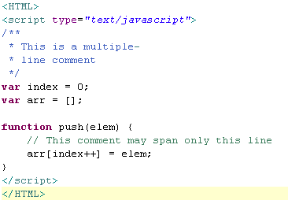
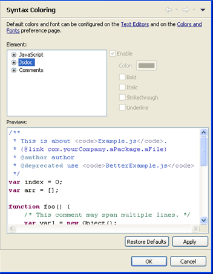

# Using JavaScript Syntax Coloring

<!--context:using_javascript_syntax_coloring-->

JavaScript [Syntax Coloring](../../016-concepts/024-syntax_highlighting.md) can be applied to JavaScript code within a PHP file or a JavaScript file.

<!--ref-start-->

To enable JavaScript syntax coloring:

Enter the relevant  JavaScript tags:

Any code enclosed in the JavaScript tags will have Syntax Coloring applied to it, according to the configuration in the JavaScript Syntax Coloring Preferences page

<!--ref-end-->

### JavaScriptSyntax Coloring Configuration

JavaScript Syntax Coloring options can be configured from the JavaScript Syntax Coloring preferences page.

<!--ref-start-->

To configure JavaScript Syntax Coloring options:

 1. Go to the JavaScript Syntax Coloring preferences page, accessed from **Window | Preferences | JavaScript | Editor | Syntax Coloring**.  
 2. Select the required item from the Syntax element list.To enable Syntax Coloring for the element, ensure the "Enable" checkbox is marked.
 3. Select a color to apply to the text.
 4. Select what formatting, if any, you would like to apply to the text (Bold, Italic, Strikethrough, Underline).

<!--note-start-->

#### Note:

The Sample text box displays a preview of the different elements.

<!--note-end-->

Click **Apply** and **OK** to apply and save your settings.

<!--ref-end-->

<!--links-start-->

#### Related Links:

 * [JavaScript Support](../../016-concepts/168-javascript.md)
 * [Developing with JavaScript](000-index.md)
 * [Syntax Coloring](../../016-concepts/024-syntax_highlighting.md)
 * [Enabling JavaScript Support in PHP Projects](008-enabling_javascript_support_in_php_projects.md)
 * [Setting the JavaScript Build Path](016-setting_the_javascript_build_path.md)

<!--links-end-->
