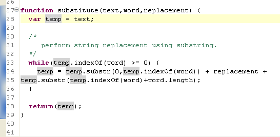

# Using JavaScript Mark Occurrences

<!--context:using_javascript_mark_occurences-->

The JavaScript Mark Occurrences feature allows you to see where a variable, method or type is referenced within a JavaScript file.

<!--ref-start-->

To use Mark Occurrences:

Stand on a variable, method or type in your file.

All instances where the element is referenced within the file will be highlighted.

<!--ref-end-->

<!--ref-start-->

To configure Mark Occurrences settings:

 1. To toggle mark occurrences, click the Toggle Mark Occurrences button  on the toolbar -or- press Alt+Shift+O.
 2. To configure further Mark Occurences preferences, go to the JavaScript Mark Occurrences preferences page, accessed from **Window | Preferences | Web | JavaScript | Editor | Mark Occurrences**.  
 3. Mark the "Mark occurrences of the selected element" checkbox to enable the Mark Occurrences feature.
 4. Select which element's occurrences will be marked by marking the checkboxes next to the required elements.
 5. Mark the "Keep marks when the selection changes'" checkbox for marks to continue to be displayed once the cursor has been moved from the selected element.
 6. Click **Apply**to apply your changes.

<!--note-start-->

#### Note:

The appearance of marked occurrences can be configured in the Annotations preferences page (**Window | Preferences | General | Editors | Text Editors | Annotations**).

<!--note-end-->

<!--ref-end-->

<!--links-start-->

#### Related Links:

 * [JavaScript Support](../../016-concepts/168-javascript.md)
 * [Developing with JavaScript](000-index.md)
 * [Enabling JavaScript Support in PHP Projects](008-enabling_javascript_support_in_php_projects.md)
 * [Setting the JavaScript Build Path](016-setting_the_javascript_build_path.md)
 * [Viewing JavaScript Elements in the Outline View](024-viewing_javascript_elements_in_the_outline_view.md)
 * [Using JavaScript Content Assist](032-using_javascript_content_assist.md)

<!--links-end-->
