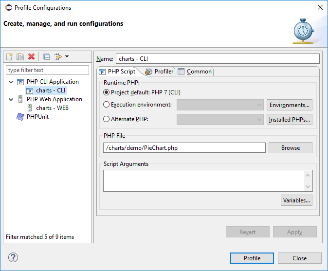
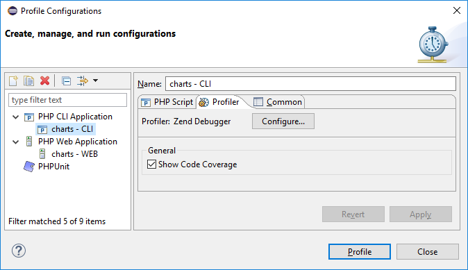

# Locally Profiling a PHP Script

<!--context:locally_profiling_a_php_script-->

This procedure describes how to profile a PHP Script from your workspace using an internal [PHP Executable](../../032-reference/032-preferences/056-php_executables/000-index.md).

1. Click the arrow next to the Profile button  on the toolbar and select **Profile Configurations...** -or- from the main menu go to **Run | Profile Configurations...** -or-right-click  in Project Explorer view and select **Profile As | Profile Configurations...**
2. A Profile launch configuration dialog will appear.
3. Double-click the **PHP CLI Application** option to create a new Profile configuration.

4. Enter a name for the new configuration.
5. Select from the following options:
<ul>
<li>Workspace default PHP - Select  to use the workspace/project default PHP</li>
<li>Execution environment - Select the execution environment you would like to use for your debug configuration from the dropdown list.</li>
<li>Alternate PHP - Select to use another PHP which can be selected from the Installed PHP's list.</li>
</ul>
6. Enter your PHP file in the **PHP File** text field, or click **Browse** and select your file.
7. If necessary, you can add arguments in the **PHP Script Arguments** tab to simulate command line inputs.
8. Select **Profiler** tab and uncheck **Show Code Coverage** option if information about code coverage is not needed.

9. Click **Apply** and then **Profile**.
10. A confirmation dialog will be displayed asking whether you want to open the profiling perspective.
Click Yes. (If you would like the profiling perspective to open by default in the future, mark the 'Remember my decision' checkbox.)

The **PHP Profile Perspective** will open, displaying the **Profiling Monitor** window with various Profiling views.

See [PHP Profile perspective](../../032-reference/008-php_perspectives_and_views/032-php_profile_perspective/000-index.md) for more on the information displayed once a profile session has been run. 

<!--links-start-->

#### Related Links:

 * [Profiling](../../016-concepts/200-profiling_concept.md)
 * [PHP Profile perspective](../../032-reference/008-php_perspectives_and_views/032-php_profile_perspective/000-index.md)
 * [Profiling PHP Web Page](016-profiling_php_web_page.md)
 * [Profiling with Browser Toolbars](024-profiling_with_browser_toolbars.md)
 * [Exporting Profile Sessions](032-exporting_profile_sessions.md)
 * [Importing Profile Sessions](040-importing_profile_sessions.md)
 * [Exporting HTML Report](048-exporting_html_report.md)

<!--links-end-->
