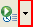
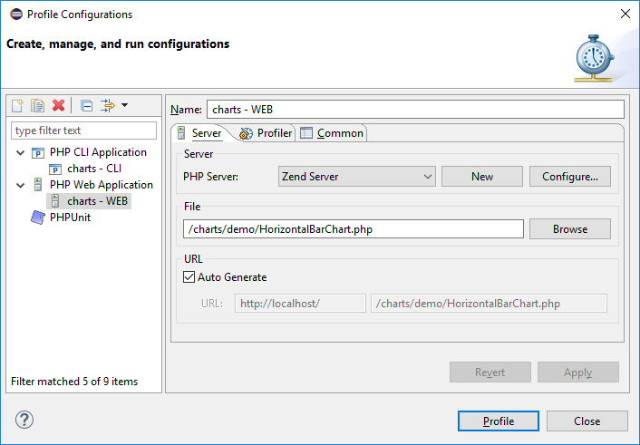
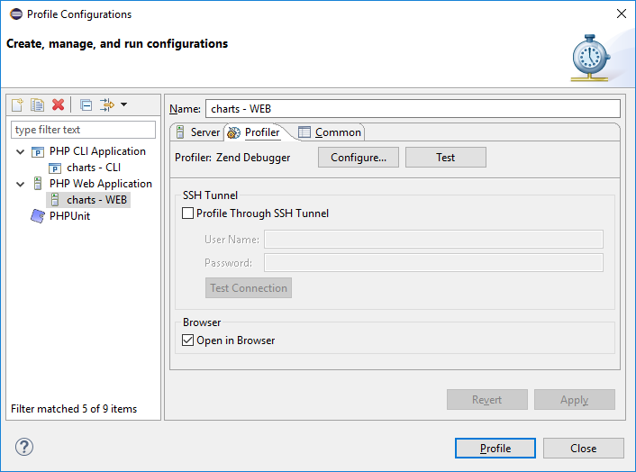

# Profiling a PHP Web Page

<!--context:profiling_a_php_web_page-->

This procedure describes how to profile whole applications, projects, files or collections of files that are already on the server.

#### Note:

For Xdebug, make sure [xdebug.profiler_enable_trigger](https://xdebug.org/docs/all_settings#profiler_enable_trigger) is enabled.

1. Click the arrow next to the Profile button  on the toolbar and select **Profile Configurations...** -or- from the main menu go to **Run | Profile Configurations...** -or-right-click  in PHP Explorer view and select **Profile As | Profile Configurations...**
2. A Profile launch configuration dialog will appear.
3. Double-click the **PHP Web Application** option to create a new Profile configuration.

4. Enter a name for the new configuration.
5. Select your server from the **PHP Server:** list. If you have not configured your server yet, click **New**, the PHP Server Creation Wizard will open.
6. Under **PHP File**, click **Browse** and select your 'profile target' file (the file from which the profiling process will start.).
7. For further profiling options, select the **Profiler** tab, which has the following options:
<ul>
<li>SSH Tunnel - Use this group option to perform profile session with the use of SSH tunneling</li>
<li>Open in Browser - Mark if you would like the application to be displayed in browser</li>
</ul>

8. Click **Apply** and then **Profile**.
9. A confirmation dialog will be displayed asking whether you want to open the profiling perspective.
Click Yes. (If you would like the profiling perspective to open by default in the future, mark the 'Remember my decision' checkbox.)

The **PHP Profile Perspective** will open, displaying the **Profiling Monitor** window with various Profiling views.

See [PHP Profile perspective](../../032-reference/008-php_perspectives_and_views/032-php_profile_perspective/000-index.md) for more on the information displayed once a profile session has been run. 

#### Note:

With Xdebug profiler, you have to manually [import profile session](040-importing_profile_sessions.md).

<!--links-start-->

#### Related Links:

 * [Profiling](../../016-concepts/200-profiling_concept.md)
 * [PHP Profile perspective](../../032-reference/008-php_perspectives_and_views/032-php_profile_perspective/000-index.md)
 * [Profiling Local PHP Script](008-profiling_local_php_script.md)
 * [Profiling with Browser Toolbars](024-profiling_with_browser_toolbars.md)
 * [Exporting Profile Sessions](032-exporting_profile_sessions.md)
 * [Importing Profile Sessions](040-importing_profile_sessions.md)
 * [Exporting HTML Report](048-exporting_html_report.md)

<!--links-end-->
