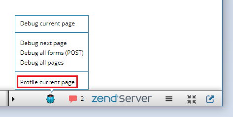
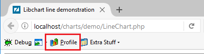

# Profiling with Browser Toolbars

<!--context:profiling_with_browser_toolbars-->

This procedure describes how to profile a PHP web application with the use of browser toolbars like [Z-Ray](http://www.zend.com/en/products/server/z-ray) or [Zend Debugger Toolbar](https://addons.mozilla.org/en-US/firefox/addon/zend-debugger-toolbar/).

### Profiling with Z-Ray

1. Ensure the **Z-Ray** is enabled and running on your [Zend Server](http://www.zend.com/en/products/zend_server).
2. Open the web page you would like to profile in a browser.
3. Ensure your PDT is open.
4. Click the 'Bug' icon on the Z-Ray toolbar and select **Profile current page** option to profile the page currently displayed in the browser.

The relevant profile session will be launched in PDT.

### Profiling with Zend Debugger Toolbar

1. Ensure the **Zend Debugger Toolbar** is installed on your browser.
2. Open the web page you would like to profile in a browser.
3. Ensure your PDT is open.
4. Click the 'Profile' icon on the Zend Debugger Toolbar to profile the page currently displayed in the browser.

The relevant profile session will be launched in PDT.

### Profiling with Xdebug toolbars

1. Ensure the **Xdebug helper** or **The easiest Xdebug** is installed on your browser.
2. Make sure [xdebug.profiler_enable_trigger](https://xdebug.org/docs/all_settings#profiler_enable_trigger) is enabled
3. Open the web page you would like to profile in a browser.
4. Ensure your PDT is open.
5. Click the 'Profile' icon on the Xdebug Toolbar to profile the page currently displayed in the browser.

You Xdebug will create CacheGrind. Now you can [import profile session](040-importing_profile_sessions.md)

<!--links-start-->

#### Related Links:

 * [Profiling](../../016-concepts/200-profiling_concept.md)
 * [PHP Profile perspective](../../032-reference/008-php_perspectives_and_views/032-php_profile_perspective/000-index.md)
 * [Profiling Local PHP Script](008-profiling_local_php_script.md)
 * [Profiling PHP Web Page](016-profiling_php_web_page.md)
 * [Exporting Profile Sessions](032-exporting_profile_sessions.md)
 * [Importing Profile Sessions](040-importing_profile_sessions.md)
 * [Exporting HTML Report](048-exporting_html_report.md)

<!--links-end-->
