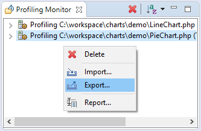
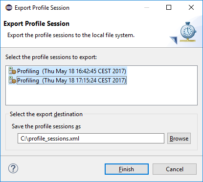

# Exporting Profile Sessions

<!--context:exporting_profile_sessions-->

This procedure describes how to export PHP profile session(s) to local file system.

1. Open **Profiling Monitor** view if it is not already opened.
2. Right-click in the view to activate context menu and choose **Export...** option to open **Export Profile Session** wizard.

3. Select the profile sessions you would like to export.
4. Specify the location for a file with the profile session(s) data.

5. Press **Finish** button to export the profile session(s).

<!--links-start-->

#### Related Links:

 * [Profiling](../../016-concepts/200-profiling_concept.md)
 * [PHP Profile perspective](../../032-reference/008-php_perspectives_and_views/032-php_profile_perspective/000-index.md)
 * [Profiling Local PHP Script](008-profiling_local_php_script.md)
 * [Profiling PHP Web Page](016-profiling_php_web_page.md)
 * [Importing Profile Sessions](040-importing_profile_sessions.md)
 * [Exporting HTML Report](048-exporting_html_report.md)

<!--links-end-->
