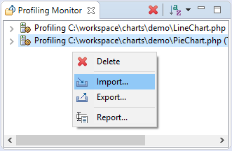
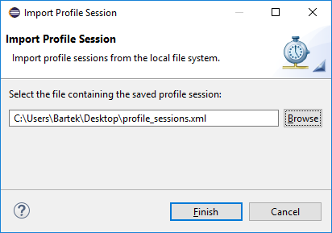

# Importing Profile Sessions

<!--context:importing_profile_sessions-->

This procedure describes how to import PHP profile session(s) to PDT.

1. Open **Profiling Monitor** view if it is not already opened.
2. Right-click in the view to activate context menu and choose **Import...** option to open **Import Profile Session** wizard.

3. Choose profiling session format: **Eclipse XML** or **CacheGrind** for Xdebug sessions. 
4. Specify the location of a file with the profile session(s) that you would like to import to PDT.

5. Press **Finish** button to import the profile session(s).

<!--links-start-->

#### Related Links:

 * [Profiling](../../016-concepts/200-profiling_concept.md)
 * [PHP Profile perspective](../../032-reference/008-php_perspectives_and_views/032-php_profile_perspective/000-index.md)
 * [Profiling Local PHP Script](008-profiling_local_php_script.md)
 * [Profiling PHP Web Page](016-profiling_php_web_page.md)
 * [Exporting Profile Sessions](032-exporting_profile_sessions.md)
 * [Exporting HTML Report](048-exporting_html_report.md)

<!--links-end-->
