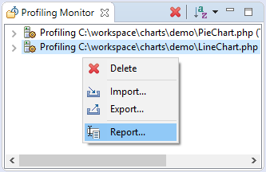
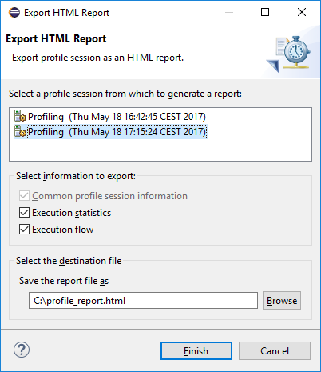

# Exporting HTML Report

<!--context:exporting_html_report-->

This procedure describes how to export PHP profile session data as an HTML report.

1. Open **Profiling Monitor** view if it is not already opened.
2. Right-click in the view to activate context menu and choose **Report...** option to open **Export HTML Report** wizard.

3. Select the profile session you would like to export as an HTML report.
4. Choose the type of information that you would like to report by checking/unchecking options in **Select information to export:** group.
5. Specify the location for a file with the report data.

6. Press **Finish** button to export the report data.

<!--links-start-->

#### Related Links:

 * [Profiling](../../016-concepts/200-profiling_concept.md)
 * [PHP Profile perspective](../../032-reference/008-php_perspectives_and_views/032-php_profile_perspective/000-index.md)
 * [Profiling Local PHP Script](008-profiling_local_php_script.md)
 * [Profiling PHP Web Page](016-profiling_php_web_page.md)
 * [Exporting Profile Sessions](032-exporting_profile_sessions.md)
 * [Importing Profile Sessions](040-importing_profile_sessions.md)

<!--links-end-->
