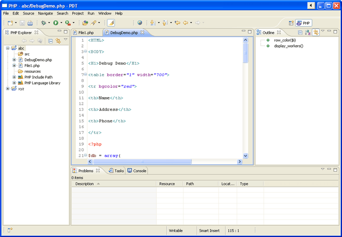

# PHP Perspective

<!--context:php_perspective_views-->

The PHP Perspective is PDT 's default perspective. It incorporates all PDT 's PHP project/file creation, inspection and editing functionality.

The PHP Perspective contains the following views:

 * [Project Explorer View](008-php_explorer_view.md)
 * [Outline View](016-php_outline_view.md)
 * [Type Hierarchy View](024-type_hierarchy_view.md)
 * [Problems View](PLUGINS_ROOT/org.eclipse.platform.doc.user/concepts/cprbview.htm)
 * [Tasks View](PLUGINS_ROOT/org.eclipse.platform.doc.user/concepts/ctskview.htm)
 * [Console View](PLUGINS_ROOT/org.eclipse.jdt.doc.user/reference/views/console/ref-console_view.htm)

<!--links-start-->

#### Related Links:

 * [PHP Debug Perspective](../../../032-reference/008-php_perspectives_and_views/016-php_debug_perspective/000-index.md)

<!--links-end-->
