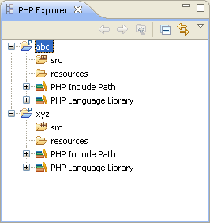

# Project Explorer View

<!--context:php_explorer_view-->

<!--note-start-->

#### Note:

Since 6.0.0, PHP Development Tools use common [Project Explorer](PLUGINS_ROOT/org.eclipse.platform.doc.user/reference/ref-27.htm).

<!--note-end-->

The Project Explorer view is an internal file system browser, allowing you to view all PHP projects and files in your Workspace. It shows the PHP element hierarchy of PHP projects in the Workbench and provides you with a PHP-specific view of your available resources. Within each project, source folders and referenced libraries are shown in the tree. In addition, this view shows all PHP code elements (classes, functions, variables, etc.). Clicking an element or declaration will cause the corresponding code to be displayed in the PHP editor.

See [PHP Icons](../../../032-reference/048-php_icons.md) for a description of the icons displayed in the Project Explorer view.

#### Project Explorer View Toolbar Commands

<table>
<tr><th>Icon</th>
<th>Name</th>
<th>Description</th></tr>

<tr><td></td>
<td>Back/Forward</td>
<td>Scrolls backwards and forwards through your recently navigated resources.  These icons will only be active if the 'Go into the selected element' option is selected in the [PHP Preferences Page](../../../032-reference/032-preferences/008-php.md) (available from Window | Preferences | PHP).</td></tr>

<tr><td></td>
<td>Up</td>
<td>Navigates up one level.  This icon will only be active if the 'Go into the selected element' option is selected in the [PHP Preferences Page](../../../032-reference/032-preferences/008-php.md) (available from Window | Preferences | PHP).</td></tr>

<tr><td></td>
<td>Collapse All</td>
<td>Collapses the list of elements</td></tr>

<tr><td></td>
<td>Link with Editor</td>
<td>If selected, elements will immediately be displayed in the editor when selected. If unselected, elements will be displayed in the editor when they are double-clicked.</td></tr>
</table>

#### Project Explorer View Menu Commands

The view's menu can be accessed through the view menu icon .

<table>
<tr><th>Icon</th>
<th>Name</th>
<th>Description</th></tr>

<tr><td></td>
<td>Top Level Elements</td>
<td>Select to view your projects grouped by Project or Working Set.</td></tr>

<tr><td></td>
<td>Select Working Set</td>
<td>If Show Projects was selected (above), allows you to select a specific Working Set to view. See [PHP Working Sets](../../../016-concepts/088-php_working_sets.md) for more information.</td></tr>

<tr><td></td>
<td>Deselect Working Set</td>
<td>Deselects the Working Set (if selected).</td></tr>

<tr><td></td>
<td>Edit Active Working Set</td>
<td>Allows you to edit the selected Working Set. See [PHP Working Sets](../../../016-concepts/088-php_working_sets.md) for more information.</td></tr>

<tr><td></td>
<td>Filters..</td>
<td>Opens the PHP Elements filters dialog which allows you to select which elements will be excluded from being displayed in the view. You select to exclude elements according to name or type.</td></tr>

<tr><td></td>
<td>Group by namespaces</td>
<td>Sorts elements by namespaces (for projects using PHP 5.3 only).</td></tr>

<tr><td></td>
<td>Link With Editor</td>
<td>If selected, elements will immediately be displayed in the editor when selected. If unselected, elements will be displayed in the editor when they are double-clicked.</td></tr>
</table>

<!--note-start-->

#### Note:

The Project Explorer View is displayed by default as part of the PHP Perspective. To manually open the view, go to Window | Show View | Other | PHP Tools | Project Explorer.

<!--note-end-->

<!--links-start-->

#### Related Links:

 * [PHP Perspective](000-index.md)
 * [PHP Functions View](../../../032-reference/008-php_perspectives_and_views/024-php_additional_views/008-php_functions_view.md)
 * [PHP Project Outline View](../../../032-reference/008-php_perspectives_and_views/024-php_additional_views/016-project_outline_view.md)
 * [Outline View](016-php_outline_view.md)
 * [Eclipse Project Explorer](PLUGINS_ROOT/org.eclipse.platform.doc.user/reference/ref-27.htm)

<!--links-end-->
