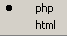

# Outline View

<!--context:outline_view-->

The Outline view displays all PHP elements and element types in the current active file. The elements are grouped according to type and are displayed in a tree-like browser.

See [PHP Icons](../../../032-reference/048-php_icons.md) for a description of the icons displayed in the Outline view.

#### Features

 * The Outline View is updated interactively according to changes made in the files.
 * Each type of PHP element is represented by a unique icon:

<table>
<tr><td></td>

<td>Reserved PHP Words</td></tr>

<tr><td></td>

<td>Functions</td></tr>

<tr><td></td>

<td>Templates</td></tr>

<tr><td></td>

<td>Classes</td></tr>

<tr><td></td>

<td>Interfaces</td></tr>

<tr><td></td>

<td>Constants</td></tr>

<tr><td></td>

<td>Variables (public)</td></tr>

<tr><td></td>

<td>Namespaces (PHP 5.3 only)</td></tr>

<tr><td></td>

<td>Use Statements (PHP 5.3 only)</td></tr>

</table>

 * The Outline view is integrated with the Editor. Therefore, if you select a PHP element in the view, the Editor will jump to the element's declaration in the file in which it is declared.

<!--note-start-->

#### Note:

Toggle the link to Editor on/off using the Link with Editor button .

<!--note-end-->

The View enables you to add PHPdoc blocks and, if available, Getters and Setters to any PHP element:

<!--ref-start-->

To generate a PHP DocBlock :

1. Right-click the element in Outline view.
2. Select Source | Add PHP Doc .

The relevant PHP DocBlock or Getter/Setter will be created above the code for the selected element in the editor.

<!--ref-end-->

Outline View Toolbar Commands

<table>
<tr><th>Icon</th>

<th>Name</th>

<th>Description</th></tr>

<tr><td></td>

<td>Collapse All</td>

<td>Collapses the list of elements</td></tr>

<tr><td></td>

<td>Sort</td>

<td>Sorts the list alphabetically</td></tr>

<tr><td></td>

<td>Show Groups</td>

<td>If selected, elements will be displayed in Groups (include files, constants, classes, functions)</td></tr>

<tr><td></td>

<td>Link with Editor</td>

<td>If selected, elements will immediately be displayed in the editor when single-clicked. If unselected, elements will be displayed in the editor when they are double-clicked.</td></tr>

</table>

Outline View Menu Commands

The view's menu can be accessed through the view menu icon .

<table>
<tr><th>Icon</th>

<th>Name</th>

<th>Description</th></tr>

<tr><td></td>

<td>Link with Editor</td>

<td>If selected, elements will immediately be displayed in the editor when single-clicked. If unselected, elements will be displayed in the editor when they are double-clicked.</td></tr>

<tr><td></td>

<td>Show Attributes</td>

<td>If selected, element attributes will be displayed. These are defined by the element's [PHP Doc Block](../../../016-concepts/064-commenting_code/008-phpdoc_comments.md).</td></tr>

<tr><td></td>

<td>PHP/HTML selection</td>

<td>Toggles the view to display PHP or HTML elements.</td></tr>

</table>

<!--note-start-->

#### Note:

The Outline View is displayed by default as part of the PHP Perspective. To manually open the view, go to Window | Show View | Other | PHP Tools | Outline.

<!--note-end-->

<!--links-start-->

#### Related Links:

 * [PHP Perspective](000-index.md)
 * [Project Explorer view](008-php_explorer_view.md)
 * [PHP Functions View](../../../032-reference/008-php_perspectives_and_views/024-php_additional_views/008-php_functions_view.md) 
 * [PHP Project Outline View](../../../032-reference/008-php_perspectives_and_views/024-php_additional_views/016-project_outline_view.md)

<!--links-end-->