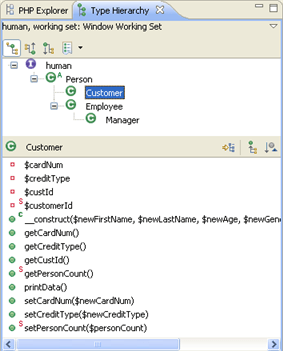
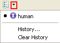

# Type Hierarchy View

<!--context:type_hierarchy_view-->

The Type Hierarchy view display the hierarchy for a given type (a class name, interface name or class methods, constants and fields.). This allows you to view an element's supertypes (types higher in the hierarchy) or subtypes (lower in the hierarchy) within a tree structure, providing you with an overview of your element's structure.

See [Viewing Types in the Type Hierarchy View](../../../024-tasks/096-viewing_type_hierarchies.md#view_type_hierarchy_view) for information on how to open a type in the Type Hierarchy view.

The Type Hierarchy view consists of two panes:

 * The Type Hierarchy Tree - Displays the type's supertypes and/or subtypes.
 * Member list pane  -  Displays the type's members.

Type Hierarchy Tree Pane Toolbar Commands

<table>
<tr><th>Icon</th>
<th>Name</th>
<th>Description</th></tr>

<tr><td></td>
<td>Show the Type Hierarchy</td>
<td>Displays the type in its full context (i.e., superclasses and subclasses) in the Type Hierarchy view.</td></tr>

<tr><td></td>
<td>Show the Supertype Hierarchy</td>
<td>Displays the supertypes and the hierarchy of all implemented interfaces of the type.
  
Note: The selected type is always at the top level, in the upper-left corner.</td></tr>

<tr><td></td>
<td>Show the Subtype Hierarchy</td>
<td>Displays the subtypes of the selected class and/or all implementors of the interface in the Hierarchy view.
  
Note: The selected type is always at the top level, in the upper-left corner.</td></tr>

<tr><td></td>
<td>Previous Hierarchy Inputs</td>
<td>Displays a history of previously displayed type hierarchies.</td></tr>

</table>

Type Hierarchy Member List Pane Toolbar Commands

<table>
<tr><th>Icon</th>
<th>Name</th>
<th>Description</th></tr>

<tr><td></td>
<td>Lock View and Show Members in Hierarchy</td>
<td>Only displays the members implementing the selected method.
  
When the view is locked, the member list pane no longer tracks the selection in the Type Hierarchy Tree Pane.</td></tr>

<tr><td></td>
<td>Show All Inherited Members</td>
<td>Shows or hides all methods and fields inherited by base classes. When this option is enabled, the name of the type that defines the method is appended to the method name.</td></tr>

<tr><td></td>
<td>Sort Members by the Defining Type</td>
<td>Sorts the members according to the type in which they are defined.</td></tr>
</table>

Type Hierarchy View Menu Commands

The view's menu can be accessed through the view menu icon .

<table>
<tr><th>Icon</th>
<th>Name</th>
<th>Description</th></tr>

<tr><td>  </td>
<td>Show the Type / Supertype or Subtype Hierarchy</td>
<td>Selects whether to display the type, supertype or subtype hierarchy in the Type Hierarchy Tree Pane (see above).</td></tr>

<tr><td></td>
<td>Select/Deselect/Edit Working Set</td>
<td>Allows you to view only types from within a specific Working Set. See [PHP Working Sets](../../../016-concepts/088-php_working_sets.md) for more information.</td></tr>

<tr><td></td>
<td>Layout</td>
<td>Allows you to select the display of the panes within the Type Hierarchy view.
  
The options are:

<ul>
 <li>Vertical View Orientation</li>
 <li>Horizontal View Orientation</li>
 <li>Automatic View Orientation</li>
 <li>Hierarchy View Only</li>
</ul>
</td></tr>

<tr><td></td>
<td>Show Qualified Type Names</td>
<td>Displays only qualified type names</td></tr>

<tr><td></td>
<td>Link With Editor</td>
<td>If selected, elements will immediately be displayed in the editor when selected. If unselected, elements will be displayed in the editor when they are double-clicked.</td></tr>
</table>

<!--links-start-->

#### Related Links:

 * [Type Hierarchy](../../../016-concepts/096-show_type_hierarchy.md)
 * [Viewing Type Hierarchies](../../../024-tasks/096-viewing_type_hierarchies.md)

<!--links-end-->
