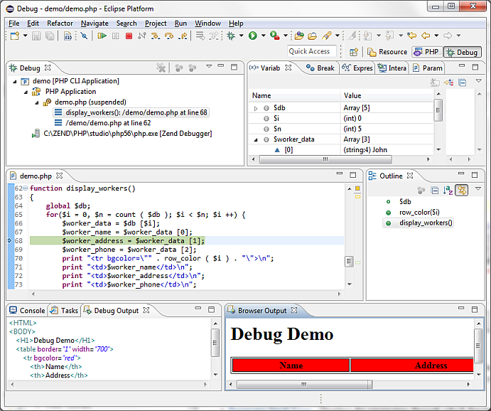

# PHP Debug Perspective

<!--context:php_debug_perspective-->

The PHP Debug Perspective can be launched automatically when a Debug session is run. It contains views which allow you to control and monitor the debugging process.

The PHP Debug Perspective contains the following views:

 * [Debug View](008-debug_view.md) - Here you can control (stop, pause, and resume) the debugging process. You can also decide whether to step into, step over or step return (step out of) certain functions.
 * [Variables View](016-variables_view.md)  - Displays the various variables in your script.
 * [Breakpoints View](024-breakpoints_view.md) - Displays the breakpoints you have entered.
 * [Debug Output View](048-debug_output_view.md) - Displays the textual output of the script. This will be updated as the debugging process continues.
 * [Browser Output View](056-browser_output_view.md) - Displays the output of the script to a browser. This will be updated as the debugging process continues.
 * [Expressions View](040-expressions_view.md) - Displays the progress of selected variables. The view will only be displayed if you have selected to watch a variable.
 * Scripts View - Displays a list of available scripts.
 * Editor - Displays the code at the relevant sections, according to which line is selected in the Debug View window.
 * [Console View](PLUGINS_ROOT/org.eclipse.jdt.doc.user/reference/views/console/ref-console_view.htm) - Displays any error and warning messages.
 * [Tasks View](PLUGINS_ROOT/org.eclipse.platform.doc.user/concepts/ctskview.htm) - Displays tasks that were added to your script (if applicable).

<!--note-start-->

#### Note:

By default, a dialog will appear asking whether you want to open the Debug Perspective when a debugging session is run. To change this behavior, open the Perspectives Preferences dialog by going to Window | Preferences | Run/Debug | Perspectives and select Always, Never or Prompt in the 'Open the associated perspective when launching' category.

<!--note-end-->

<!--links-start-->

#### Related Links:

 * [Debug View](008-debug_view.md)
 * [Variables View](016-variables_view.md)
 * [Breakpoints View](024-breakpoints_view.md)
 * [Debug Output View](048-debug_output_view.md)
 * [Browser Output View](056-browser_output_view.md)
 * [Expressions View](040-expressions_view.md)

<!--links-end-->
