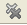
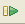
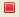
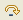
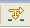

# Debug View [PHP Debug Perspective]

<!--context:debug_view-->

The Debug view displays the stack trace and allows you to monitor and control the Debugging process.

![Debug View [PHP Debug Perspective]](images/debug_view.png "Debug View [PHP Debug Perspective]")

Debug View Toolbar Commands

<table>
<tr><th>Icon</th>
<th>Name</th>
<th>Description</th></tr>

<tr><td></td>
<td>Remove Terminated Launches</td>
<td>Remove any terminated debug sessions from the list.</td></tr>

<tr><td></td>
<td>Resume</td>
<td>Continue the debugging process until the next breakpoint, or until the end of the debugging process.</td></tr>

<tr><td></td>
<td>Terminate</td>
<td>Stop the debugging process.</td></tr>

<tr><td></td>
<td>Step Into</td>
<td>Step into the next method call at the currently executing line of code.</td></tr>

<tr><td></td>
<td>Step Over</td>
<td>Step over the next method call (without entering it) at the currently executing line of code. The method will still be executed.</td></tr>

<tr><td></td>
<td>Step Return</td>
<td>Return from a method which has been stepped into. The remainder of the code that was skipped by returning is still executed.</td></tr>

<tr><td></td>
<td>Use Step Filters</td>
<td>Enables/disables the [step filters](../../../032-reference/032-preferences/032-debug/016-step_filtering_preferences.md) functionality.</td></tr>
</table>

<!--note-start-->

#### Note:

The Debug View [PHP Debug Perspective] is displayed by default as part of the Debug Perspective. To manually open the view, go to **Window | Show View | Other | Debug | Debug**.

<!--note-end-->

<!--links-start-->

#### Related Links:

 * [PHP Debug Perspective](000-index.md)
 * [Variables View](016-variables_view.md)
 * [Breakpoints View](024-breakpoints_view.md)
 * [Parameter Stack View](032-parameter_stack.md)
 * [Debug Output View](048-debug_output_view.md)
 * [Browser Output View](056-browser_output_view.md)
 * [Expressions View](040-expressions_view.md)

<!--links-end-->
