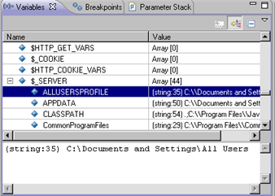
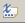
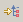
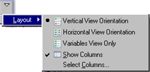

# Variables View [PHP Debug Perspective]

<!--context:variables_view-->

The Variables view displays information about the variables associated with the stack frame selected in the Debug View. Selecting a variable will display details in the detail pane below the view. Expanding the list under a variable will display its fields.

<!--note-start-->

#### Note:

Right-click a variable and select **Watch**or **Create Watch Expression** to add the variable to the [Expressions view](040-expressions_view.md).

<!--note-end-->

Variables View Toolbar Commands

<table>
<tr><th>Icon</th>
<th>Name</th>
<th>Description</th></tr>

<tr><td></td>
<td>Show Type Names</td>
<td>If selected, type names will be displayed.</td></tr>

<tr><td></td>
<td>Show Logical Structure</td>
<td>Shows the logical structure.</td></tr>

<tr><td></td>
<td>Collapse All</td>
<td>Collapses the list.</td></tr>
</table>

Variables View Menu Commands

The view's menu can be accessed through the view menu icon .

<table>
<tr><th>Name</th>
<th>Description</th></tr>

<tr><td>Layout</td>
<td>Defines the view's layout:
<ul>
 <li>Vertical View Orientation - The details pane will be displayed at the bottom of the Variables view.</li>
 <li>Horizontal View Orientation - The details pane will be displayed to the right of the Variables view.</li>
 <li>Variables View Only - Only the Variables view will be displayed.</li>
 <li>Show columns - Divide the view into columns.</li>
 <li>Set Columns - Only available if "Show columns" is selected. Allows you to choose which of the following columns to display:</li>
 <li>Name</li>
 <li>Declared Type</li>
 <li>Value</li>
 <li>Actual Type</li>

</ul></td></tr>
</table>

<!--note-start-->

#### Note:

The Variables View [PHP Debug Perspective] is displayed by default as part of the Debug Perspective. To manually open the view, go to **Window | Show View | Other | Debug | Variables**.

<!--note-end-->

<!--links-start-->

#### Related Links:

 * [PHP Debug Perspective](000-index.md)
 * [Debug View](008-debug_view.md)
 * [Breakpoints View](024-breakpoints_view.md)
 * [Debug Output View](048-debug_output_view.md)
 * [Browser Output View](056-browser_output_view.md)
 * [Expressions View](040-expressions_view.md)

<!--links-end-->
