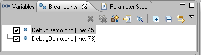
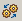
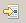
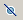
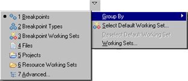

# Breakpoints View [PHP Debug Perspective]

<!--context:breakpoints_view-->

The Breakpoints view displays and allows you to monitor and control the breakpoints set in the files being debugged.

Breakpoints View Toolbar Commands

<table>
<tr><th>Icon</th>
<th>Name</th>
<th>Description</th></tr>

<tr><td></td>
<td>Remove Selected Breakpoints</td>
<td>Removes the selected Breakpoints from the file.</td></tr>

<tr><td></td>
<td>Remove All Breakpoints</td>
<td>Removes all Breakpoints from the file.</td></tr>

<tr><td></td>
<td>Show Breakpoints Supported By Selected Targets</td>
<td>If selected, only breakpoints supported by the current 'debug target' will be displayed. For example, iIf a PHP file is being debugged, only PHP breakpoints will be displayed.</td></tr>

<tr><td></td>
<td>Go to File for Breakpoint</td>
<td>Opens the resource in which the breakpoint is located.</td></tr>

<tr><td></td>
<td>Skip All Breakpoints</td>
<td>If selected, all breakpoints will be skipped and execution will not stop.</td></tr>

<tr><td></td>
<td>Expand All</td>
<td>Expands all items in the list.</td></tr>

<tr><td></td>
<td>Collapse All</td>
<td>Collapses all items in the list.</td></tr>

<tr><td></td>
<td>Link with Debug View</td>
<td>If selected, clicking a breakpoint will link with the Debug view.</td></tr>
</table>

Breakpoints View Menu Commands

The view's menu can be accessed through the view menu icon .

<table>
<tr><th>Name</th>
<th>Description</th></tr>

<tr><td>Group By</td>
<td>
<ul>
 <li>Breakpoints</li>
 <li>Breakpoint Types</li>
 <li>Breakpoint Working Sets</li>
 <li>Files</li>
 <li>Projects</li>
 <li>Resource Working Sets</li>
 <li>Advanced</li>
</ul>
</td></tr>

<tr><td>Select/Deselect Default Working Set</td>
<td>Allows you to choose the default breakpoint working set from the Default Working Set dialog.</td></tr>

<tr><td>Working Sets</td>
<td>Opens the [Working Sets dialog](../../../016-concepts/088-php_working_sets.md).</td></tr>
</table>

<!--note-start-->

#### Note:

The Breakpoints View [PHP Debug Perspective] is displayed by default as part of the Debug Perspective. To manually open the view, go to **Window | Show View | Other | Debug | Breakpoints**.

<!--note-end-->

<!--links-start-->

#### Related Links:

 * [PHP Debug Perspective](000-index.md)
 * [Breakpoints](../../../016-concepts/136-breakpoints.md)
 * [Setting Breakpoints](../../../024-tasks/152-debugging/008-setting_breakpoints.md)
 * [Debug View](008-debug_view.md)[Variables View](016-variables_view.md)
 * [Parameter Stack View](032-parameter_stack.md)
 * [Debug Output View](048-debug_output_view.md)
 * [Browser Output View](056-browser_output_view.md)
 * [Expressions View](040-expressions_view.md)

<!--links-end-->
