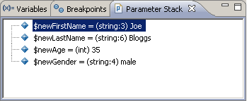

# Parameter Stack View [PHP Debug Perspective]

<!--context:parameter_stack-->

The Parameter Stack view displays the parameters executed when stepping into a function during the debugging process.

The following information can be gathered from the Parameter Stack view:

 * Called Parameters - The called parameters as written in the line or code.
 * The Main Calling Line of Code - The line number in which the calling statement occurred (in parentheses).
 * Parameter Values - Shows the parameter values that were passed in the function call.

<!--note-start-->

#### Note:

The Parameter Stack View [PHP Debug Perspective] is displayed by default as part of the Debug Perspective. To manually open the view, go to **Window | Show View | Other | PHP Tools | Parameter Stack**.

<!--note-end-->

<!--links-start-->

#### Related Links:

 * [PHP Debug Perspective](000-index.md)
 * [Debug View](008-debug_view.md)
 * [Variables View](016-variables_view.md)
 * [Breakpoints View](024-breakpoints_view.md)
 * [Debug Output View](048-debug_output_view.md)
 * [Browser Output View](056-browser_output_view.md)
 * [Parameter Stack View](032-parameter_stack.md)

<!--links-end-->
