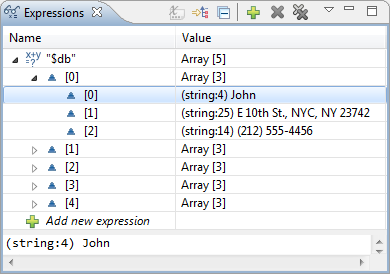
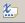
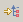
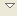

# Expressions View [PHP Debug Perspective]

<!--context:expressions_view-->

The Expressions view will not open by default when a debugging session is launched, but only when you have selected to watch a variable or create a watch expression.

To watch a variable, right-click a variable in the editor or from the variables view and select **Watch**or **Add Watch Expression**. The Expressions view will open and the variable will be added to it. The variable's information will be updated as the debugging process continues.

<!--note-start-->

#### Note:

To manually open the Expressions view, go to **Window | Show View | Debug | Expressions**.

<!--note-end-->

The Expressions view allows you to monitor certain variables which you have decided to 'watch' during the debugging process. Selecting a variable will display details in the detail pane below the view. Expanding the list under a variable will display its fields.

Expressions View Toolbar Commands

<table>
<tr><th>Icon</th>
<th>Name</th>
<th>Description</th></tr>

<tr><td></td>
<td>Show Type Names</td>
<td>Displays type names</td></tr>

<tr><td></td>
<td>Show Logical Structure</td>
<td>Displays the logical structure.</td></tr>

<tr><td></td>
<td>Collapse All</td>
<td>Collapses the list.</td></tr>
</table>

Expressions View Menu Commands

The view's menu can be accessed through the view menu icon .

<table>
<tr><th>Name</th>
<th>Description</th></tr>
<tr><td>Layout</td>

<td>Defines the view's layout:
<ul>
 <li>Vertical View Orientation - The details pane will be displayed at the bottom of the Variables view.</li>
 <li>Horizontal View Orientation - The details pane will be displayed to the right of the Variables view.</li>
 <li>Expressions View Only - Only the Watched Variables pane  will be displayed.</li>
</ul>
</td></tr>
</table>

<!--links-start-->

#### Related Links:

 * [Variables View](016-variables_view.md)
 * [PHP Debug Perspective](000-index.md)
 * [Debug View](008-debug_view.md)
 * [Breakpoints View](024-breakpoints_view.md)
 * [Parameter Stack View](032-parameter_stack.md)
 * [Debug Output View](048-debug_output_view.md)
 * [Browser Output View](056-browser_output_view.md)

<!--links-end-->
