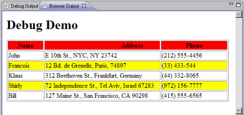

# Browser Output View [PHP Debug Perspective]

<!--context:browser_output_view-->

The Browser Output view will show the output of the script to a browser. This will be updated as the debugging process continues.

<!--note-start-->

#### Note:

The Browser Output View [PHP Debug Perspective] is displayed by default as part of the Debug Perspective. To manually open the view, go to **Window | Show View | Other | PHP Tools | Browser Output**.

<!--note-end-->

<!--links-start-->

#### Related Links:

 * [PHP Debug Perspective](000-index.md)
 * [Debug View](008-debug_view.md)
 * [Variables View](016-variables_view.md)
 * [Breakpoints View](024-breakpoints_view.md)
 * [Debug Output View](048-debug_output_view.md)

<!--links-end-->
