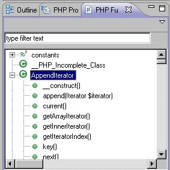
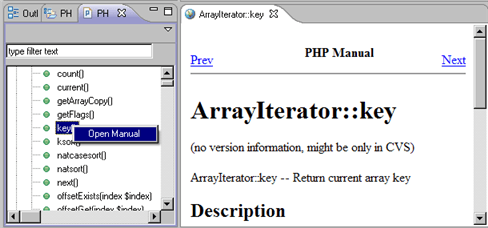

# PHP Functions View

<!--context:php_functions_view-->

The PHP Functions view lists most commonly used PHP Classes, Constants and Iterators. The PHP Functions view can be used in order to easily add functions into your scripts. To add a function to your code, simply place the cursor in the required position in the Editor and double-click the required element from the list.

To access the view, go to Window | Show View | Other | PHP Tools | PHP Functions.

Right-clicking a function in PHP Functions view and selecting Open Manual will open an online version of the PHP manual with an explanation about most of the functions on the list.

A new browser window will open with an explanation of the function from the PHP Manual.

<!--note-start-->

#### Note:

If the browser opens with a 'Cannot find server' error message, it means the function does not have a description assigned to it in the PHP Manual.

Sites for viewing the PHP Manual can be added and edited from the [PHP Manual Preferences](../../../032-reference/032-preferences/072-php_manual.md) page.

<!--note-end-->

#### PHP Functions View Toolbar commands

<table>
	<tr><th>Icon</th>
	<th>Name</th>
	<th>Description</th></tr>
	<tr><td></td>
	<td>Filter Text box</td>
	<td>Allows you to find a particular function. Start typing the function name. Relevant results will be displayed below it.</td></tr>
</table>

#### PHP Functions View Menu Commands

The view's menu can be accessed through the view menu icon .

<table>
	<tr><th>Icon</th>
	<th>Name</th>
	<th>Description</th></tr>
	<tr><td></td>
	<td>PHP Version selection</td>
	<td>Allows you to choose between PHP4 and PHP5 functions.</td></tr>
</table>

<!--links-start-->

#### Related Links:

 * [PHP Perspective](../../../032-reference/008-php_perspectives_and_views/008-php_perspective_views/000-index.md)
 * [Project Explorer view](../../../032-reference/008-php_perspectives_and_views/008-php_perspective_views/008-php_explorer_view.md)
 * [PHP Project Outline View](016-project_outline_view.md)
 * [Outline View](../../../032-reference/008-php_perspectives_and_views/008-php_perspective_views/016-php_outline_view.md)

<!--links-end-->
