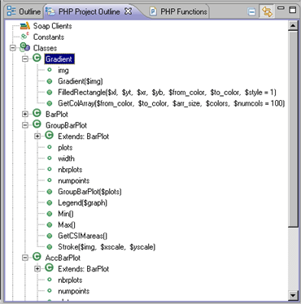

# PHP Project Outline View

<!--context:project_outline_view-->

The PHP Project Outline view displays a list of Soap Clients, Constants, Classes and Functions for all files within the selected project.

Selecting an element in the PHP Project Outline view will open the relevant file in the editor.

To access the view, go to Window | Show View | Other | PHP Tools | PHP Project Outline.

PHP Project Outline View Toolbar commands

<table>
	<tr><th>Icon</th>
	<th>Name</th>
	<th>Description</th></tr>
	<tr><td></td>
	<td>Collapse All</td>
	<td>Collapses the list of elements</td></tr>
	<tr><td></td>
	<td>Link with Editor</td>
	<td>If selected, elements will immediately be displayed in the editor when they are single-clicked. If unselected, elements will be displayed in the editor when they are double-clicked.</td></tr>
</table>

<!--links-start-->

#### Related Links:

 * [PHP Perspective](../../../032-reference/008-php_perspectives_and_views/008-php_perspective_views/000-index.md)
 * [Project Explorer view](../../../032-reference/008-php_perspectives_and_views/008-php_perspective_views/008-php_explorer_view.md)
 * [PHP Functions View](008-php_functions_view.md)
 * [Outline View](../../../032-reference/008-php_perspectives_and_views/008-php_perspective_views/016-php_outline_view.md)

<!--links-end-->
