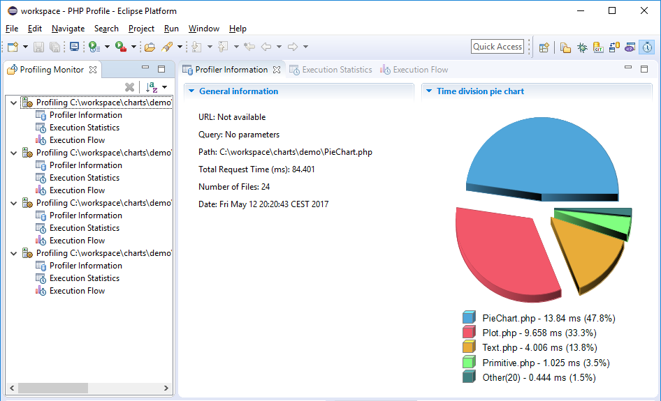

# PHP Profile Perspective

<!--context:php_profile_perspective-->

The **PHP Profile Perspective** can be launched automatically when a profile session is run. It allows you to view all the information relevant to scripts that you profile.

<!--note-start-->

#### Note:

To configure whether the **PHP Profile Perspective** is launched automatically when a profile session is run, go to **Window | Preferences | PHP | Profile** and select Always, Never or Prompt in the 'Open associated perspective on receiving session data' category.

<!--note-end-->

As a default, the PHP Profile Perspective contains the following views:

 * [Profiling Monitor View](008-profiling_monitor_view.md) - displays a list of previously run profiling sessions.
 * [Profiler Information View](016-profiler_information_view.md)  - provides general information about profiling sessions such as: duration, date, number of files constructing the requested URL and more.
 * [Execution Statistics View](024-execution_statistics_view.md) - displays the list of files that were called during the profiling process and detailed information on processing times for elements within the files.
 * [Execution Flow View](032-execution_flow_view.md) - shows the flow of the execution process and summarizes percentages and times spent on each function.
 
There are also additional views that can be opened by the appropriate action on profile session data items:
 
 * [Code Coverage Summary View](040-code_coverage_summary_view.md) - summary of how many lines of code were covered during the profiling process.
 * [Code Coverage View](048-code_coverage_view.md) - shows the graphical presentation of code coverage for chosen PHP script.
 * [Function Invocation Statistics View](056-function_invocation_statistics_view.md) - displays statistics about the selected function, the functions it was invoked by and functions that it invoked.

<!--links-start-->

#### Related Links:

 * [Profiling](../../../016-concepts/200-profiling_concept.md)
 * [Profiling Monitor View](008-profiling_monitor_view.md)
 * [Profiler Information View](016-profiler_information_view.md)
 * [Execution Statistics View](024-execution_statistics_view.md)
 * [Execution Flow View](032-execution_flow_view.md)
 * [Code Coverage Summary View](040-code_coverage_summary_view.md)
 * [Code Coverage View](048-code_coverage_view.md)
 * [Function Invocation Statistics View](056-function_invocation_statistics_view.md)

<!--links-end-->
