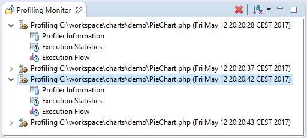
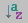

# Profiling Monitor View

<!--context:profiling_monitor_view-->

The Profiling Monitor view displays a list of previously run Profiling sessions.

Expanding the list under a Profiling session allows you to select a Profiling view with the related data to display.

#### Toolbar Commands

<table>
<tr><th>Icon</th>
<th>Name</th>
<th>Description</th></tr>

<tr><td></td>
<td>Delete Session</td>
<td>Deletes a Profiling session from the list. This will be enabled if a profiling session is selected.</td></tr>

<tr><td></td>
<td>Sort Profile Sessions</td>
<td>Click the arrow next to the Profile Session to sort the Profile Session list by date or time.</td></tr>

</table>

<!--links-start-->

#### Related Links:

 * [PHP Profile Perspective](000-index.md)
 * [Profiler Information View](016-profiler_information_view.md)
 * [Execution Statistics View](024-execution_statistics_view.md)
 * [Execution Flow View](032-execution_flow_view.md)
 * [Code Coverage Summary View](040-code_coverage_summary_view.md)
 * [Code Coverage View](048-code_coverage_view.md)
 * [Function Invocation Statistics View](056-function_invocation_statistics_view.md)
 * [Exporting Profile Sessions](../../../024-tasks/216-profiling/032-exporting_profile_sessions.md)
 * [Importing Profile Sessions](../../../024-tasks/216-profiling/040-importing_profile_sessions.md)
 * [Exporting HTML Report](../../../024-tasks/216-profiling/048-exporting_html_report.md)

<!--links-end-->
