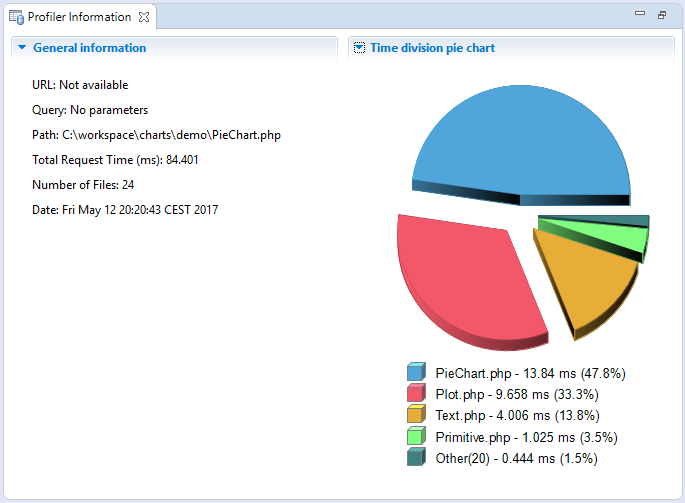

# Profiler Information View

<!--context:profiler_information_view-->

The Profiler Information view provides general information about profiling sessions such as: duration, date, number of files constructing the requested URL and more. In addition, a Pie Chart is generated that shows the time division of the files in the URL.

The right side of the view displays time division in a pie chart and the left side provides the following information:
 * URL - The URL analyzed (if applicable)
 * Query - The specific query parameters
 * Path - The location of the first file called
 * Total Request Time - Total processing time for the entire page
 * Number of Files - Number of files processed
 * Date - Date and time that the profiling took place 

<!--links-start-->

#### Related Links:

 * [PHP Profile Perspective](000-index.md)
 * [Profiling Monitor View](008-profiling_monitor_view.md)
 * [Execution Statistics View](024-execution_statistics_view.md)
 * [Execution Flow View](032-execution_flow_view.md)
 * [Code Coverage Summary View](040-code_coverage_summary_view.md)
 * [Code Coverage View](048-code_coverage_view.md)
 * [Function Invocation Statistics View](056-function_invocation_statistics_view.md)

<!--links-end-->
