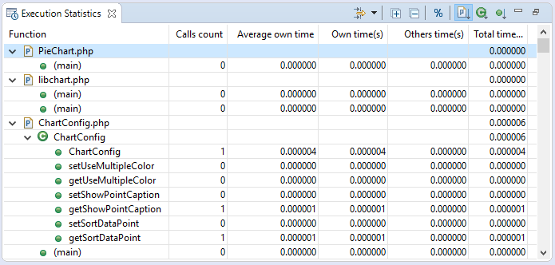

# Execution Statistics View [PHP Profile Perspective]

<!--context:execution_statistics_view-->

The Execution Statistics view displays the list of files that were called during the profiling process and detailed information on processing times for elements within the files.

The window contains statistics relevant to each element as follows:
 * Function - The name and location of the function.
 * Calls Count - The number of times that the function was called.
 * Average Own Time - The average duration without internal calls.
 * Own Time(s) - The net process duration without internal calls.
 * Others Time(s) - Time spent on calling other files.
 * Total Time(s) - The total time taken to process.

<!--note-start-->

#### Note:

Click the 'Show as percentage' button on the toolbar to see the statistics as percentages rather than times.

<!--note-end-->

#### Context Menu

Right- clicking a function in the list gives you the option to **Open Function Invocation statistics**. This will open a view with statistics about the selected function, the functions it was invoked by and functions that it invoked.

#### Toolbar Commands

<table>
<tr><th>Icon</th>
<th>Name</th>
<th>Description</th></tr>

<tr><td></td>
<td>Filters...</td>
<td>Click the arrow next to the icon to select to display only the results with:
<ul>
<li>Highest 10 own time</li>
<li>Highest 10 calls</li>
<li>Highest 10 total time</li>
<li>Highest 10 average time</li>
<li>-Or- No filter.</li>
</ul>
Click the icon itself or select Manage Filters from the list to launch the Edit filter dialog which allows you to create or edit your own filter conditions.</td></tr>

<tr><td></td>
<td>Expand/Collapse all</td>
<td>Expands/collapses the list.</td></tr>

<tr><td></td>
<td>Show as Percentage</td>
<td>Toggles the view to show your times in seconds or percentages.</td></tr>

<tr><td></td>
<td>Group by File</td>
<td>Sorts the list by file.</td></tr>

<tr><td></td>
<td>Group by Class</td>
<td>Sorts the list by class.</td></tr>

<tr><td></td>
<td>Group by Function</td>
<td>Sorts the list by function.</td></tr>

</table>

<!--links-start-->

#### Related Links:

 * [PHP Profile Perspective](000-index.md)
 * [Profiling Monitor View](008-profiling_monitor_view.md)
 * [Profiler Information View](016-profiler_information_view.md)
 * [Execution Flow View](032-execution_flow_view.md)
 * [Code Coverage Summary View](040-code_coverage_summary_view.md)
 * [Code Coverage View](048-code_coverage_view.md)
 * [Function Invocation Statistics View](056-function_invocation_statistics_view.md)

<!--links-end-->
