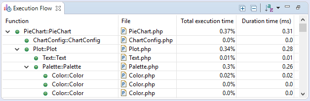
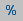
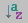

# Execution Flow View [PHP Profile Perspective]

<!--context:execution_flow_view-->

The Execution Flow view shows the flow of the execution process and summarizes percentages and times spent on each function.
Function Information

The view displays the following information for each function:
 * Function - Function name.
 * File - The file in which the function is located.
 * Total Execution Time - Percent of time taken per function.
 * Duration Time - Time taken per function. In milliseconds.
 

#### Context Menu

Right-clicking a function in the list gives you the option to:
 * View Function Call - Opens the selected function call in the editor.
 * View Function Declaration - Opens the selected function declaration in the editor.
 * Open Function Invocation statistics - Opens a view with statistics about the selected function, the functions which the selected function was invoked by, and the functions invoked by the selected function.

#### Toolbar Commands

<table>
<tr><th>Icon</th>
<th>Name</th>
<th>Description</th></tr>

<tr><td></td>
<td>Expand/Collapse all</td>
<td>Expands/collapses the list.</td></tr>

<tr><td></td>
<td>Show as Percentage</td>
<td>Toggles the view to show your times in seconds or percentages.</td></tr>

<tr><td></td>
<td>Sort Profile Sessions</td>
<td>Click the arrow next to the Profile Session to sort the Profile Session list by the Order in which the functions were executed or by Duration Time.</td></tr>

</table>

<!--links-start-->

#### Related Links:

 * [PHP Profile Perspective](000-index.md)
 * [Profiling Monitor View](008-profiling_monitor_view.md)
 * [Profiler Information View](016-profiler_information_view.md)
 * [Execution Statistics View](024-execution_statistics_view.md)
 * [Code Coverage Summary View](040-code_coverage_summary_view.md)
 * [Code Coverage View](048-code_coverage_view.md)
 * [Function Invocation Statistics View](056-function_invocation_statistics_view.md)

<!--links-end-->
