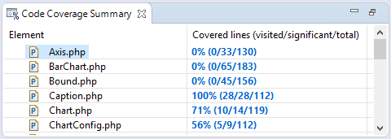

# Code Coverage Summary View [PHP Profile Perspective]

<!--context:code_coverage_summary_view-->

The Code Coverage Summary view presents how many lines of code were covered during the profiling process. The table with coverage information consists of the following columns:
 * Element - The file / project that was called.
 * Covered Lines (Visited / Significant / Total) - Percentage of lines covered within each file. (Visited = Number of lines covered / Significant = number of lines that were significant to the function call / Total = Total number of lines in the file.)

Clicking on the 'Covered lines' percentages will open [Code Coverage View](048-code_coverage_view.md) containing the related file, with the covered lines highlighted:

<!--links-start-->

#### Related Links:

 * [Code Coverage Preferences](../../032-preferences/096-code_coverage.md)
 * [PHP Profile Perspective](000-index.md)
 * [Profiling Monitor View](008-profiling_monitor_view.md)
 * [Profiler Information View](016-profiler_information_view.md)
 * [Execution Statistics View](024-execution_statistics_view.md)
 * [Execution Flow View](032-execution_flow_view.md)
 * [Code Coverage View](048-code_coverage_view.md)
 * [Function Invocation Statistics View](056-function_invocation_statistics_view.md)

<!--links-end-->
