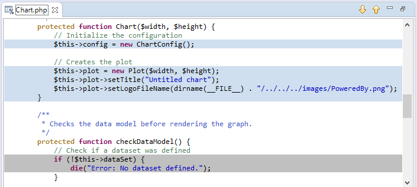

# Code Coverage View [PHP Profile Perspective]

<!--context:code_coverage_view-->

The Code Coverage view shows file contents with the covered/uncovered lines highlighted. This view is opened after clicking on the 'Covered lines' percentages row in [Code Coverage Summary View](040-code_coverage_summary_view.md).

#### Toolbar Commands

<table>
<tr><th>Icon</th>
<th>Name</th>
<th>Description</th></tr>

<tr><td></td>
<td>Show next line</td>
<td>Shows next covered/uncovered code line.</td></tr>

<tr><td></td>
<td>Show previous line</td>
<td>Shows previous covered/uncovered code line.</td></tr>

</table>

<!--links-start-->

#### Related Links:

 * [PHP Profile Perspective](000-index.md)
 * [Profiling Monitor View](008-profiling_monitor_view.md)
 * [Profiler Information View](016-profiler_information_view.md)
 * [Execution Statistics View](024-execution_statistics_view.md)
 * [Execution Flow View](032-execution_flow_view.md)
 * [Code Coverage Summary View](040-code_coverage_summary_view.md)
 * [Function Invocation Statistics View](056-function_invocation_statistics_view.md)

<!--links-end-->
