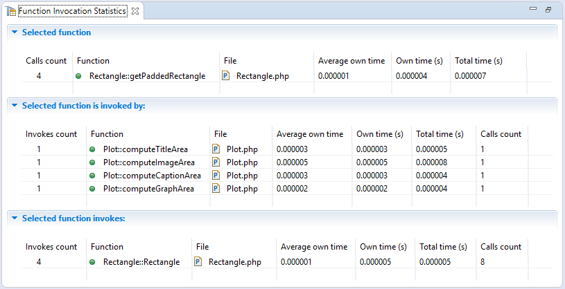

# Function Invocation Statistics View [PHP Profile Perspective]

<!--context:function_invocation_statistics_view-->

The Function Invocation Statistics view displays statistics about the selected function, the functions it was invoked by and functions it invoked. This view is opened after running **Open Function Invocation statistics** command on selected function in [Execution Flow View](032-execution_flow_view.md).

<!--links-start-->

#### Related Links:

 * [PHP Profile Perspective](000-index.md)
 * [Profiling Monitor View](008-profiling_monitor_view.md)
 * [Profiler Information View](016-profiler_information_view.md)
 * [Execution Statistics View](024-execution_statistics_view.md)
 * [Execution Flow View](032-execution_flow_view.md)
 * [Code Coverage Summary View](040-code_coverage_summary_view.md)
 * [Code Coverage View](048-code_coverage_view.md)

<!--links-end-->
