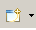
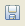
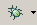
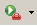
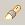
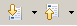

# PHP Perspective Main Toolbar

<!--context:php_perspective_main_toolbar-->

The PHP Perspective's Main Toolbar offers shortcuts to frequently used functionality:

<table>
<tr><th>Shortcut Icon</th>
<th>Shortcut Keys</th>
<th>Name</th>
<th>Description</th></tr>

<tr><td></td>
<td></td>
<td>New</td>
<td>Clicking on the icon opens the New Wizard dialog.  
Clicking the arrow next to the icon lets you select to create a new PHP Project, Project, PHP File, Folder, CSS, HTML, XML, Example Project or Other resource.</td></tr>

<tr><td></td>
<td>Ctrl+S</td>
<td>Save</td>
<td>Saves the active file.</td></tr>

<tr><td></td>
<td>Ctrl+P</td>
<td>Print</td>
<td>Prints the active file.</td></tr>

<tr><td></td>
<td></td>
<td>Debug</td>
<td>Clicking the Debug Button executes the last run configuration.
  
Clicking the arrow next to the icon gives access to the following options:
<ul>
 <li>Debug a previously executed launch configuration.</li>
 <li>Debug As... - Debug the active file as a Debug on Server, Java Applet, Java Application, JUnit Plug-in Test, JUnit Test, PHP Script or PHP Web Page.</li>
 <li>Open Debug dialog - Opens the Debug dialog.</li>
 <li>Organize Favorites - Allows you to select which launch configurations should be added to your Favorites list. Your Favorite launches will be listed first in the launch configuration list.</li>
</ul></td></tr>

<tr><td></td>
<td></td>
<td>Run</td>
<td>Clicking the Run As button executes the last run configuration.
  
Clicking the arrow next to the icon gives access to the following options:

<ul>
 <li>Run a previously executed launch configuration.</li>
 <li>Run As... - Run the active file as a Run on Server, Java Applet, Java Application, JUnit Plug-in Test, JUnit Test, PHP Script or PHP Web Page.</li>
 <li>Open Run dialog - Opens the Run dialog.</li>
 <li>Organize Favorites - Allows you to select which launch configurations should be added to your Favorites list. Your Favorite launches will be listed first in the launch configuration list.</li>
</ul></td></tr>

<tr><td></td>
<td></td>
<td>External Tools</td>
<td>Clicking the External Tools Button opens the External Tools Configuration dialog.
  
Clicking the arrow next to the icon gives access to the following options:

<ul>
 <li>Run As - If applicable, allows you to run the file using External tools.</li>
 <li>Open External Tools Dialog - Opens the configuration dialog for running a file using external tools.</li>
 <li>Organize Favorites - Opens a dialog allowing you to organize your external tools.</li>
</ul>
See the [External Tools](PLUGINS_ROOT/org.eclipse.platform.doc.user/concepts/concepts-exttools.htm)  topic in the Workbench User Guide for more information.
</td></tr>

<tr><td></td>
<td>Ctrl+H</td>
<td>Search</td>
<td>Launches the Search dialog.</td></tr>

<tr><td></td>
<td></td>
<td>Open Web Browser</td>
<td>Opens an internal web browser.</td></tr>

<tr><td></td>
<td>Ctrl+.  Ctrl+,</td>
<td>Next/Previous Annotation</td>
<td>Navigates to the next / previous annotation in the script.
  
Possible annotations are: Bookmarks, Diff additions, Diff changes, Errors, Info, Search Results, Spelling Errors, Tasks and Warnings.
  
Click the arrow next to the next / previous annotation icon on the toolbar to configure which types of annotations should be included.</td></tr>

<tr><td></td>
<td>Ctrl+Q</td>
<td>Last Edit Location</td>
<td>Jumps to the last location that was edited.</td></tr>

<tr><td></td>
<td>Alt+Left  Alt+Right</td>
<td>Back/forward to last edited file</td>
<td>Scrolls through the previous/next edited locations in all edited file in the current session.</td></tr>
</table>

<!--links-start-->

#### Related Links:

 * [Menus](../032-reference/016-menus/000-index.md)
 * [File](../032-reference/016-menus/008-file/000-index.md)
 * [Edit](../032-reference/016-menus/016-edit.md)
 * [Source](../032-reference/016-menus/024-source.md)
 * [Refactor](../032-reference/016-menus/032-refactor.md)
 * [Navigate](../032-reference/016-menus/040-navigate.md)
 * [Search](../032-reference/016-menus/048-search.md)
 * [Project](../032-reference/016-menus/056-project.md)
 * [Run](../032-reference/016-menus/064-run.md)
 * [Window](../032-reference/016-menus/080-window.md)
 * [Help](../032-reference/016-menus/088-help.md)
 
<!--links-end-->
