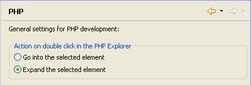

# PHP PreferencesPage

<!--context:php-->

The PHP Preferences page allows you to configure the hierarchy display in Project Explorer view and set double-click behavior.

The PHP Preferences page is accessed from Window | Preferences | PHP .

<!--ref-start-->

To configure PHP Preferences:

 1. Select the required option:
    * Go into the selected element -  Project Explorer view will display only a folder's contents once it is double-clicked.
    * Expand the selected element - Project Explorer view will expand a folder once it is double-clicked, leaving the other projects and folders visible in a tree diagram.
 2. Click Apply to apply your settings.

<!--ref-end-->

<!--links-start-->

#### Related Links:

 * [PHP Preferences](000-index.md)
 * [Navigate Menu](../../032-reference/016-menus/040-navigate.md)

<!--links-end-->
