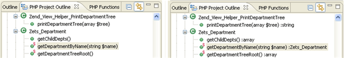
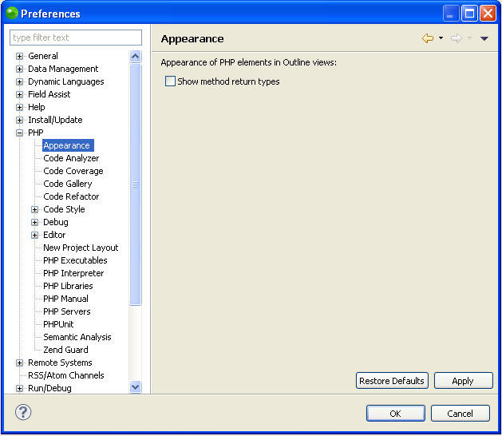

# Appearance Preferences

<!--context:appearance_preferences-->

The Appearance preferences page allows you to select whether to show PHP Elements' method return types in the Outline and PHP Project Outline views. These will be displayed in brackets next to the element.

<table>
<tr><td>PHP Project Outline view without the method return types display</td>
<td>PHP Project Outline view with the method return types display</td></tr>
</table>

The Appearance Preferences page is accessed from Window | Preferences | PHP | Appearance .

<!--ref-start-->

To display element's return type methods:

 1. Mark the 'Show methods return types checkbox'.
 2. Click Apply to apply your settings.

<!--ref-end-->

<!--links-start-->

#### Related Links:

 * [PHP Preferences](000-index.md)

<!--links-end-->
