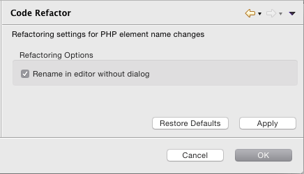

# Code Refactor Preferences

<!--context:code_refactor_preferences-->

The Code Refactor Preferences page allows you to enable the in-place refactoring option. This option allows you to rename elements using the refactoring feature from within the editor rather than through the refactor dialog.

See the [Refactoring](../../016-concepts/076-refactoring.md) topic for more information on refactoring or [Renaming Elements](../../024-tasks/116-using_refactoring/016-renaming_elements).

The Code Refactor Preferences page is accessed from **Window | Preferences | PHP | Code Refactor**.

 

## Configuring Your Code Refactor Settings

<!--ref-start-->

To configure your Code Refactor settings:

1. Mark the 'Rename in editor without dialog' checkbox to enable you to rename elements in the editor rather than through the refactor dialog.
2. Click Apply to apply your changes.

<!--ref-end-->

<!--links-start-->

#### Related Links:

 * [PHP Preferences](000-index.md)

<!--links-end-->
