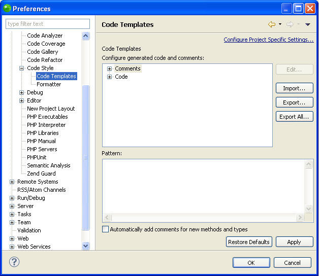

# Code Templates Preferences

<!--context:code_templates_preferences-->

The Code Templates Preferences page allows you to configure the code and comments that are automatically created for different types of elements.

The Code Templates Preferences page is accessed from **Window | Preferences | PHP | Code Style | Code Templates**.

<!--ref-start-->

To edit the pattern for a comment or code element:

 1. Expand the list and select the required element.
 2. Click **Edit**.  The "Edit Template" dialog is displayed.
 3. Edit the pattern as required and click **OK**.
 4. If required, mark the 'Automatically add comments for new methods and types' box for comments to be automatically generated when new methods and types are created.
 5. Click **Apply** to apply your changes.

<!--ref-end-->

### Exporting and Importing Code Templates

PDT enables you to export and import code templates, which are created within XML files in the following format:

    <?xml version="1.0" encoding="UTF-8" standalone="no"?>
    <templates>
        <template
            autoinsert="true" context="php" deleted="false" description="description" enabled="true" id="org.eclipse.php.ui.editor.templates.php.codetemplates.xxxcomment" name="name">
            /** * ${tags} */
        </template>
    </templates>

<!--ref-start-->

To import a code template:

 1. Click Import to open the "Import Templates" browser.
 2. Select the relevant XML file containing the template information.
 3. Click **Open**.

The templates contained in the template.xml file will be imported into the list of Templates.

<!--ref-end-->

<!--ref-start-->

To export a code template:

 1. Select the template(s) for export from the Template list.
 2. Click **Export**to open the "Export Templates" dialog.
 3. Select the location to save the XML file to.
 4. Click **Save**.

An XML file will be created with the template information.

<!--ref-end-->

<!--ref-start-->

To export all code templates:

 1. Click **Export All**.
 2. Select the location to save the XML file to.
 3. Click **Save**.

An XML file will be created with the template information.

<!--ref-end-->

<!--note-start-->

#### Note:

If you selected more than one template to export, all of them will be present in the exported XML file. Each of the original Templates is bounded by: `<template></template>`

<!--note-end-->

<!--links-start-->

#### Related Links:

 * [Templates Preferences](../../../032-reference/032-preferences/040-editor/064-templates.md)
 * [PHP Preferences](../../../032-reference/032-preferences/000-index.md)
 * [phpDoc Block Comments](../../../016-concepts/064-commenting_code/008-phpdoc_comments.md)

<!--links-end-->
