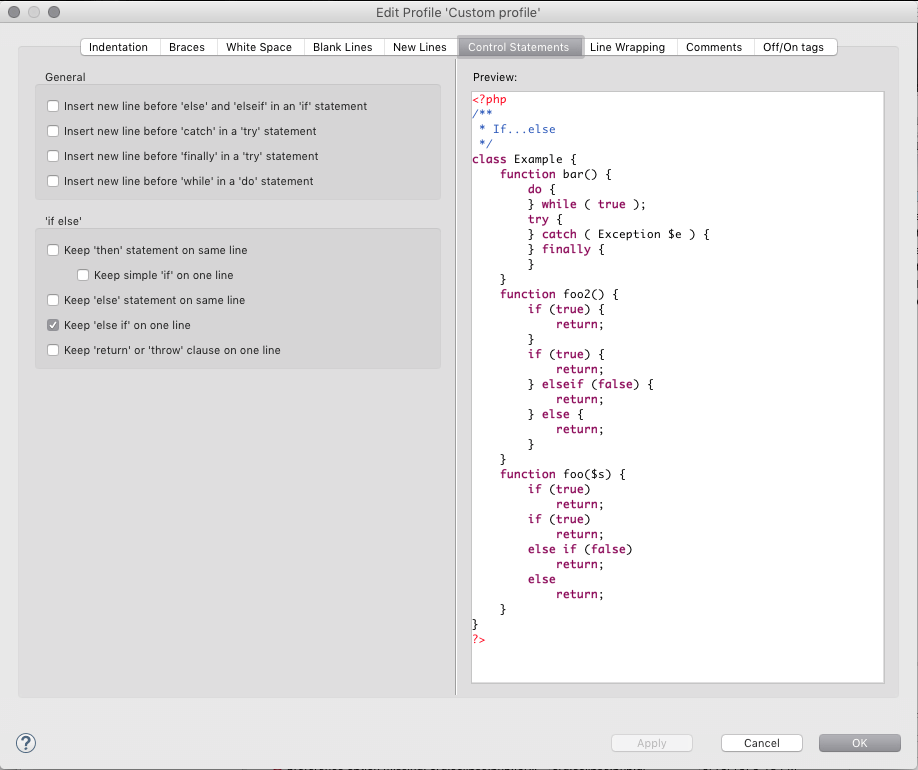

# Formatter Preferences

<!--context:formatter_preferences-->

The Formatter Preferences page allows you to select advanced PHP formatter profile. 

The Formatter Preferences Preferences page is accessed from **Window | Preferences | PHP | Formatter Preferences** .

<!--ref-start-->

To apply Formatter Preferences settings to a specific project only:

 1. Select the link labelled "Configure Project Specific Settings".
 2. Select the required project from the list.  A Formatter Preferences Properties dialog will appear.
 3. Select the required settings and click Apply.  A prompt dialog will appear stating that a rebuild of the project must occur for the settings to take effect.
 4. Click Yes to rebuild the project.  -Or- Click No for a rebuild to be performed only when PDT is restarted.  -Or- Click Cancel to cancel the operation.

<!--ref-end-->

<!--ref-start-->

To change your formatter options you can either select one of the built-in profiles or create a new profile. To create a new profile select **New...** You can then edit the new profile by selecting **Edit...**.

<!--ref-end-->

<!--note-start-->

#### Note:

Built-in profiles can be only previewed, use **Show...** to see them.

<!--note-end-->

<!--ref-start-->

Each profile can be exported to XML view **Export...**. Later can be imported into different workspace by **Import...** dialog.

<!--ref-end-->

<!--links-start-->

#### Related Links:

 * [Formatting Code](../../../024-tasks/048-formatting_code.md)
 * [PHP Preferences](../../../032-reference/032-preferences/000-index.md)

<!--links-end-->
