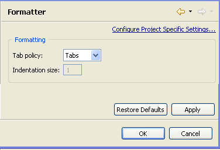

# Formatter Preferences

<!--context:formatter_preferences-->

The Formatter Preferences page allows you to set the editor's Tab policy.

The Formatter Preferences Preferences page is accessed from Window | Preferences | PHP | Formatter Preferences .

Select whether Tabs will be set by using Tabs or Spaces by selecting the required options from the drop-down Tab policy list.

If you selected Spaces, set the indentation size.

<!--ref-start-->

To apply Formatter Preferences settings to a specific project only:

 1. Select the link labelled "Configure Project Specific Settings".
 2. Select the required project from the list.  A Formatter Preferences Properties dialog will appear.
 3. Select the required settings and click Apply.  A prompt dialog will appear stating that a rebuild of the project must occur for the settings to take effect.
 4. Click Yes to rebuild the project.  -Or- Click No for a rebuild to be performed only when PDT is restarted.  -Or- Click Cancel to cancel the operation.

<!--ref-end-->

<!--links-start-->

#### Related Links:

 * [Formatting Code](../../../024-tasks/048-formatting_code.md)
 * [PHP Preferences](../../../032-reference/032-preferences/000-index.md)

<!--links-end-->
