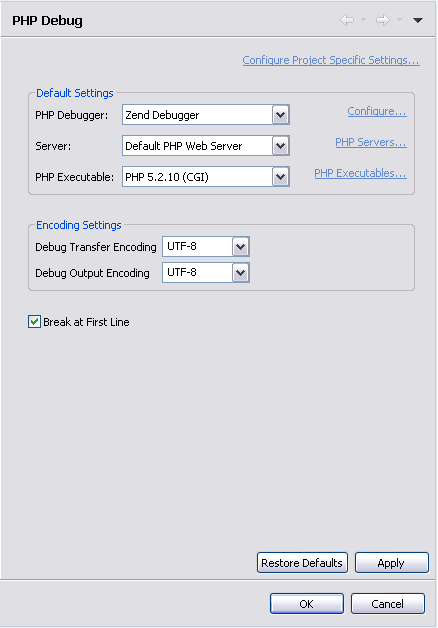

# Debug Preferences

<!--context:debug_preferences-->

The Debug preferences page allows you to configure default settings for the debugging process.

The Debug Preferences Preferences page is accessed from Window | Preferences | PHP | Debug Preferences .

The settings that can be configured from the debug preferences page are:

Default Settings

 * PHP Debugger - Select which debugger will be used by default.
 * Server - Choose which server the debugger will use by default. Click the "PHP Servers" category to be taken to the PHP Servers management page. For more on this, see [PHP Servers.](../../../032-reference/032-preferences/080-php_servers.md)
 * PHP Executable - Choose the required default PHP version. Click the "PHP Executables" category to be taken to the PHP Executables management page. For more on this, see [PHP Executables.](../../../032-reference/032-preferences/056-php_executables.md)

Encoding Settings

 * Debug Transfer Encoding - Select the required debug transfer encoding from the drop-down list.
 * Debug Output Encoding  - Select the required debug output encoding from the drop-down list.
 * Break at First Line - Mark this checkbox to force the debugging process to stop at the first line of code by default.

<!--note-start-->

#### Note:

Further PHP encoding options can be accessed from the preferences menu under General | Content Types | Text | PHP Content Type.

<!--note-end-->

<!--ref-start-->

To apply Debug Preferences settings to a specific project only:

 1. Select the link labelled "Configure Project Specific Settings".
 2. Select the required project from the list.  A Debug Preferences Properties dialog will appear.
 3. Select the required settings and click Apply.
 4. A prompt dialog will appear stating that a rebuild of the project must occur for the settings to take effect.
 5. Click Yes to rebuild the project. Click No for a rebuild to be performed only when PDT is restarted. Click Cancel to cancel the operation.
 
<!--ref-end-->

<!--links-start-->

#### Related Links:

 * [Debugging](../../../024-tasks/152-debugging/000-index.md)
 * [Installed Debuggers](008-installed_debuggers.md)
 * [Workbench Options](024-launching.md)
 * [PHP Preferences](../../../032-reference/032-preferences/000-index.md)

<!--links-end-->
