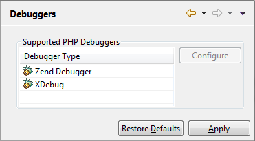

# Debuggers

<!--context:installed_debuggers-->

The Debuggers preferences page allows you to configure your Debugger settings.

The Debuggers Preferences page is accessed from **Window | Preferences | PHP | Debug | Debuggers**.

<!--ref-start-->

To e.g. configure your Zend Debugger settings:

 1. Select the Zend Debugger.
 2. Click Configure.  The Zend Debugger Settings dialog will open.

  You can configure the following:
   
 * Client Host/IP - Enter the Client Host/IP to which debugging results will be returned. PDT will automatically search for and recognize the  Client Host/IP, but entering a specific Host/IP will speed up the debugging process and decrease the likelihood of session timeouts.
 * Debug Port - The port which the Zend Debugger will use. The default port is 10137.
 * Debug Response Timeout (ms) - Debugger response timeout in milliseconds.
 * Broadcast Port - The Broadcast Port allows your Zend Browser Toolbar to detect your debugging preferences. The Broadcast Port number entered here must match the Broadcast Port entered in your Zend Browser Toolbar. The default port is 20080.
 * Dummy File Name - This is the file which the PHP Script debugger uses in order to test a PHP debugging session on a specified server. The name should be left as the default dummy.php. However, if this is changed, ensure the change has also been made on your server.
 * Display debug information when running - Mark the checkbox for Debug info, such as the Console view and the Browser Output, to be displayed when a Run configuration is executed.
 * Use New Protocol - This check-box is selected by default, and applies usage of the latest Zend Debugger engine. If you have encountered any issues with the Zend Debugger, de-select this check-box to revert to previous Zend Debugger protocol.
 

<!--note-start-->

#### Note:

Some of the debugger global settings (responsible for establishing a connection with debugger engine) can be overridden at the corresponding debugger owner level (PHP Server or PHP Executable). In case of setting up the individual connection settings for debugger owners, those will be taken into account while triggering debug session from IDE. If there is no possibility to find the debugger owner settings in IDE (e.g. when triggering the debug session outside the IDE with the use of browser toolbars) the global settings will be used to establish the connection.

<!--note-end--> 

<!--ref-end-->

<!--links-start-->

#### Related Links:

 * [Debugging](../../../024-tasks/152-debugging/000-index.md)
 * [Debuggers](008-installed_debuggers.md)
 * [Workbench Options](024-launching.md)
 * [PHP Preferences](../../../032-reference/032-preferences/000-index.md)

<!--links-end-->
