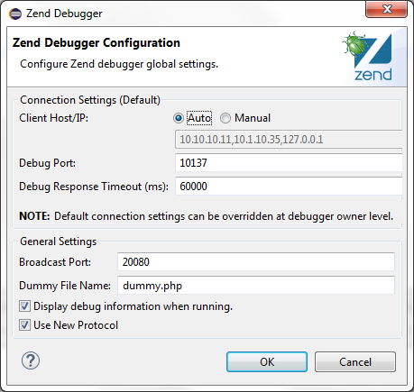

# Installed Debuggers

<!--context:installed_debuggers-->

The Installed Debuggers preferences page allows you to configure your Debugger settings.

The Installed Debuggers Preferences page is accessed from **Window | Preferences | PHP | Debug | Installed Debuggers**.

<!--ref-start-->

To configure your Zend Debugger settings:

 1. Select the Zend Debugger.
 2. Click Configure.  The Zend Debugger Settings dialog will open.

1. Configure the following:
    * Debug Port - The port which the Zend Debugger will use. The default port is 10137.
    * Run with Debug info - Mark the checkbox for Debug info, such as the Console view and the Browser Output, to be displayed when a Run configuration is executed.
    * Client Host/IP - Enter the Client Host/IP to which debugging results will be returned. PDT will automatically search for and recognize the  Client Host/IP, but entering a specific Host/IP will speed up the debugging process and decrease the likelihood of session timeouts.

<!--note-start-->

#### Note:

If the field contains too many host/IPs, the session could timeout before a debugging connection is established. Entering a non-existent host/IP could cause the session to terminate.

 1. Click OK to return to the Installed Debuggers Preferences page.
 2. Click Apply to apply your settings.
 
<!--note-end-->

<!--ref-end-->

<!--links-start-->

#### Related Links:

 * [Debugging](../../../024-tasks/152-debugging/000-index.md)
 * [Installed Debuggers](008-installed_debuggers.md)
 * [Workbench Options](024-launching.md)
 * [PHP Preferences](../../../032-reference/032-preferences/000-index.md)

<!--links-end-->
