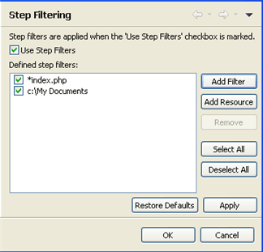

# Step Filtering Preferences

<!--context:step_filtering_preferences-->

The Step Filtering Preferences page allows you to select certain resources/file patterns which will not be 'stepped into'/displayed during debugging.

This feature should be used when there are files which you do not want to inspect during debugging. This is especially useful if you have included large external resources (such as a framework or library).

The Step Filtering Preferences page is accessed from **Window | Preferences | PHP | Debug | Step Filtering** .

To enable the step filtering feature, mark the 'Use Step Filters' checkbox and the add the required resources to the 'Defined step filters' list.

<!--note-start-->

#### Note:

The Step Filters functionality can be toggled on/off during debugging by clicking the Use Step Filters button on the Debug view toolbar.

<!--note-end-->

<!--ref-start-->

To add a file name pattern to exclude:

1\. Click Add Filter.  The Add Step Filter dialog is displayed.

2\. Enter the pattern to filter.

<!--note-start-->

#### Note:

Wild cards are enabled, so entering *index.php will exclude all resource paths ending in index.php.

<!--note-end-->

3\. Click OK.

The file exclusion pattern will be added to the step filters list.

<!--note-end-->

<!--ref-start-->

To add a resource to exclude:

 1. Click Add Resource.  The Select Resource dialog is displayed.
 2. Select the resources (projects/folders/files) which you want to exclude and click OK.

The selected resources will be added to the step filters list.

<!--ref-end-->

<!--links-start-->

#### Related Links:

 * [Debug Preferences](000-index.md)
 * [Debugging](../../../016-concepts/128-debugging_concept.md)
 * [Debug View](../../../032-reference/008-php_perspectives_and_views/016-php_debug_perspective/008-debug_view.md)

<!--links-end-->
