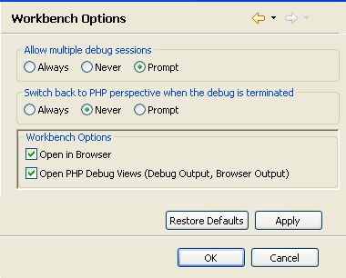

# Workbench OptionsPreferences

<!--context:launching--><!--context:workbench_options-->

The Workbench Options preferences dialog allows you to configure the default behavior of the workspace during the debugging process.

The Workbench Options Preferences page is accessed from **Window | Preferences | PHP | Debug | Workbench Options**.

The Workbench Options configuration options are:

 * Allow multiple debug sessions - Select whether to Allow multiple debug sessions to run simultaneously (Always, Never or Prompt).
 * Switch back to PHP perspective when the debug is terminated - Select whether the PHP Persepctive will open when the debug is terminated (Always, Never or Prompt).

Workbench Options

 * Open in Browser - Mark the checkbox for the debugged files to be displayed in a browser during debugging.
 * Open PHP Debug Views - Mark the 7checkbox for PHP Debug Views to be displayed when a debug session is launched.  By default, a dialog will appear when a debug session is launched asking whether you want to open the Debug Perspective when a debugging session is run. To change this behavior, open the Perspectives Preferences dialog by going to Window | Preferences | Run/Debug | Perspectives and select Always, Never or Prompt in the 'Open the associated perspective when launching' category.

<!--links-start-->

#### Related Links:

 * [Debug Preferences](000-index.md)
 * [Working with the Debugger Tutorial](../../../008-getting_started/016-basic_tutorial/024-working_with_the_debugger.md)
 * [Debugging](../../../024-tasks/152-debugging/000-index.md)
 * [Run Menu](../../../032-reference/016-menus/064-run.md)
 * [PHP Preferences](../../../032-reference/032-preferences/000-index.md)

<!--links-end-->
