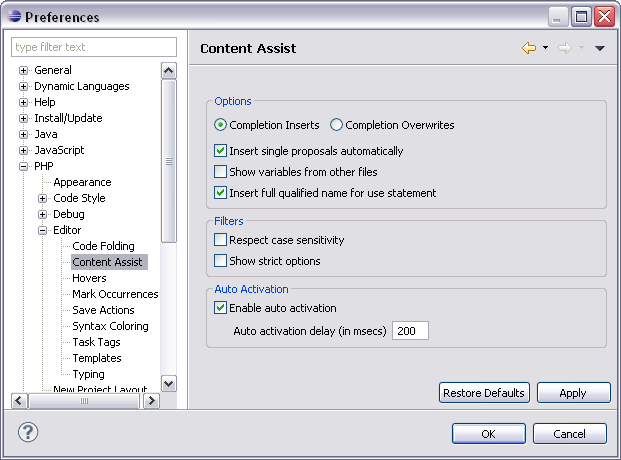

# Content Assist Preferences

<!--context:code_assist_preferences-->

The Content Assist feature enables the selection and insertion of existing code elements to complete partially entered code.

The Content Assist preferences page allows you to configure your Content Assist preferences.

The Content Assist Preferences Preferences page is accessed from **Window | Preferences | PHP | Editor | Content Assist Preferences**.

<!--ref-start-->

To configure Content Assist preferences:

Mark the required checkboxes to configure the following options:

 * Options
    * Completion Inserts / Completion Overwrites - Select whether selecting an item from the Content Assist list  will cause new code to be entered or existing code to be overwritten.
    * Insert single proposals automatically - When only one content assist suggestion exists, the content assist suggestion will be inserted automatically.
    * Show variables from other files - Shows variables which are in other files in the project.
 * Filters
    * Respect case sensitivity – Define statements are used to create global constants. One can ”r;define(’r;MY_CONST’, 5)”, and then use ”r;MY_CONST” all over the application, this property is used to determine if ”r;my_const” will also be suggested as usage of that constant.
    * Show strict options – PHP alerts users if they access static methods and fields from within an instance.  Users can enable/disable this in the php.ini file for their php copy and hence can disable the content assist for these cases.
 * Auto-activation
    * Enable auto activation - The content assist list will automatically be displayed.

<!--note-start-->

#### Note:

If this is unmarked, you can still display the content assist list by pressing Ctrl+Space.

<!--note-end-->

 * Auto activation delay: Determines the delay before the Content Assist box is automatically displayed (in msecs).
 * Auto-activation triggers for PHP: Sets the characters that determine PHP context.
 * Auto-activation triggers for PHPDoc: Sets the characters that determine PHPDoc context.

<!--note-start-->

#### Note:

A maximum of 4 characters can be entered.

<!--note-end-->

Click Apply to apply your settings.

<!--ref-end-->

<!--links-start-->

#### Related Links:

 * [Using Content Assist](../../../024-tasks/024-using_code_assist.md)
 * [Working with Con Assist](../../../008-getting_started/016-basic_tutorial/016-working_with_code_assist.md)
 * [PHP Preferences](../../../032-reference/032-preferences/000-index.md)
 * [Editor Preferences](000-index.md)

<!--links-end-->
