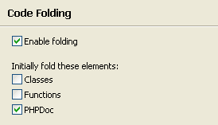

# Code Folding Preferences

<!--context:folding_preferences-->

Code Folding enables you to 'collapse', or hide, certain sections of code while you are not working on them. This enables you to manage larger amounts of code within one window.

The Code Folding preferences page allows you enable / disable code folding and to select which elements should be folded by default.

The Code Folding Preferences page is accessed from **Window | Preferences | PHP | Editor | Code Folding**.

<!--ref-start-->

To configure your code folding preferences:

 1. Mark the Enable folding checkbox to enable code to be folded.
 2. Select which off the following elements should be folded by default by marking the relevant checkboxes:
    * Classes
    * Functions
    * PHPDocs
 3. Click Apply to apply your settings.

<!--ref-end-->

<!--links-start-->

#### Related Links:

 * [Code Folding](../../../016-concepts/056-code_folding.md)
 * [Using Code Folding](../../../024-tasks/056-using_code_folding.md)
 * [PHP Preferences](../../../032-reference/032-preferences/000-index.md)
 * [Editor Preferences](000-index.md)

<!--links-end-->
