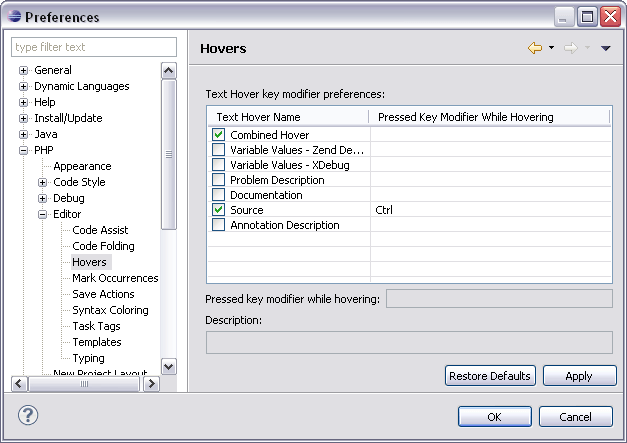

# Hovers Preferences

<!--context:hovers_preferences-->

The Hover functionality will display information about an item when the mouse is placed on it.

The Hovers preferences page allows you to configure the settings and shortcuts for the Hover functionality.

The Hovers Preferences Preferences page is accessed from Window | Preferences | PHP | Editor | Hovers Preferences .

The Text Hover key modifier preferences table allows you to modify hover key preferences for certain elements. Pressing the configured key while hovering over the element in the editor will display the relevant information or take the relevant action.  For example, applying the settings displayed in the screenshot above (Source key preference = Ctrl) and pressing Ctrl while hovering over an element in the editor will take you to that element's source.

You can configure key preferences for the following elements:

 * Combined Hover - Tries the hover in the sequence listed in the table and uses the one which fits best for the selected element and the current context.
 * Variable Values - Zend Debugger - Shows the value of the selected variable while debugging with the Zend Debugger.
 * Variable Values - Xdebug - Shows the value of the selected variable while debugging with Xdebug.
 * Documentation - Shows the documentation of the selected element.
 * Problem Description - Shows the description of the selected problem.
 * Source - Shows the source of the selected element.
 * Annotation Description - Shows the description of the selected annotation.

<!--ref-start-->

To configure the key preferences:

 1. Mark the checkbox next to the required preference.
 2. Enter the required key in the 'pressed key modifier while hovering' box.
 3. Click Apply to apply your settings.

<!--ref-end-->

<!--links-start-->

#### Related Links:

 * [Hover Support](../../../016-concepts/072-hover_support.md)
 * [PHP Preferences](../../../032-reference/032-preferences/000-index.md)
 * [Editor Preferences](000-index.md)

<!--links-end-->