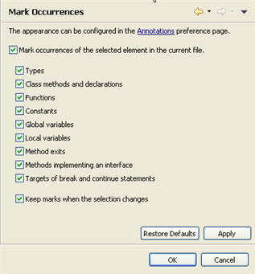
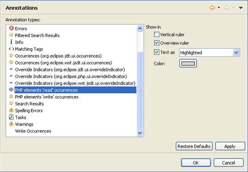

# Mark Occurrences Preferences

<!--context:mark_occurences-->

The Mark Occurrences Preferences page allows you to configure for which types of elements the [Mark Occurrences](../../../016-concepts/048-mark_occurrences.md) feature will be enabled.

The Mark Occurrences Preferences page is accessed from Window | Preferences | PHP | Editor | Mark Occurrences .

<!--ref-start-->

To configure Mark Occurrences preferences:

 1. Mark the 'Mark occurrences of the selected element in the current file' checkbox to enable the Mark Occurrences functionality.
 2. Configure the elements for which the Mark Occurrences feature will be enabled by marking the relevant checkboxes. The options are:
    * Types
    * Class Methods and declarations
    * Functions
    * Constants
    * Global variables
    * Local variables
    * Expressions throwing a declared exception
    * Method exits - Marks the exit points (throws / return / end of flow) of a method
    * Methods implementing an interface
    * Targets of break and continue statements - Marks the scope (for, foreach, while, do-while or switch structure) of a break / continue statements
    * HTML Tags
 3. Mark the 'Keep marks when the selection changes' checkbox for marks to continue to be displayed once the cursor has been moved from the selected element.
 4. Click Apply to apply your changes.

<!--ref-end-->

The appearance of the Mark Occurrences annotations which appear in the vertical ruler (to the left of the editor) and the annotation bar (to the right of the editor) can be configured in the [Annotations preferences page](PLUGINS_ROOT/org.eclipse.platform.doc.user/reference/ref-22.htm) (Window | Preferences | General | Editors | Text Editors | Annotations) by selecting PHP elements 'read' or 'write' occurrences.

<!--links-start-->

#### Related Links:

 * [Mark Occurrences](../../../016-concepts/048-mark_occurrences.md)
 * [Using Mark Occurrences](../../../024-tasks/112-using_mark_occurrences.md)
 * [PHP Preferences](../../../032-reference/032-preferences/000-index.md)
 * [Editor Preferences](000-index.md)

<!--links-end-->
